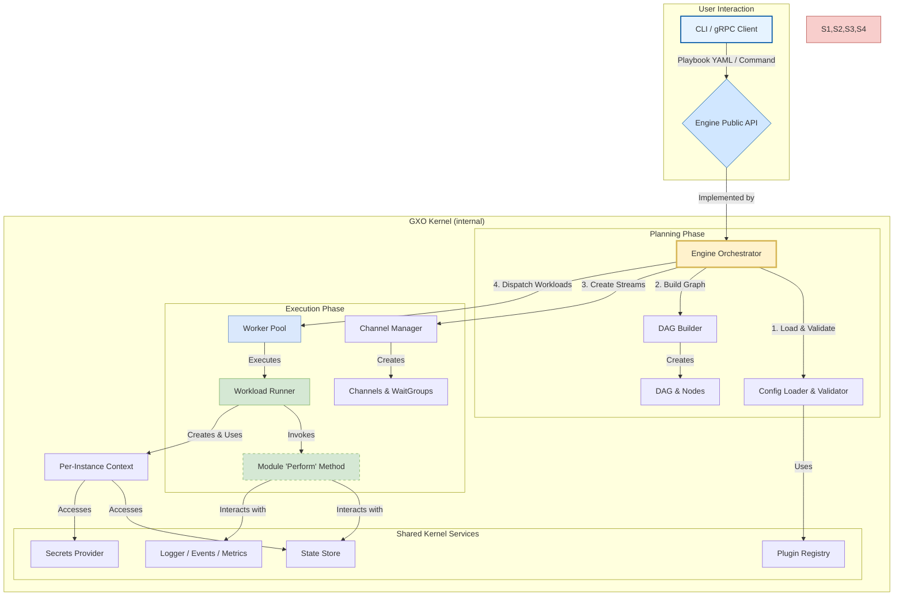

# GXO Master Architecture & Design Specification

**Document ID:** GXO-ARCH-MASTER
**Version:** 1.0
**Status:** Canonical Technical Blueprint

## Abstract

The contemporary software automation landscape is characterized by a powerful but fragmented ecosystem of specialized tools. This paper introduces GXO (Go Execution and Orchestration), a novel system designed as a **Declarative Automation Kernel**. We posit that by unifying process supervision, event-driven orchestration, and streaming data flow into a single, high-performance, lightweight runtime, GXO creates a new class of automation platform. The kernel's central abstraction is the `Workload`, a declarative unit of automation defined by its `Process` logic and a specific `Lifecycle` policy. This document provides an exhaustive, unambiguous definition of the architecture, design, implementation details, algorithms, data structures, and security model for the GXO system. It serves as the master technical blueprint.

---

## Part I: The GXO Philosophy & Core Abstractions

At its core, GXO is an opinionated implementation of an **Automation Kernel**. This is a direct and intentional analogy to a modern operating system kernel. The GXO Kernel does not perform high-level application logic itself; instead, it provides a minimal, privileged, and highly performant set of core services upon which all other functionality is built. This design philosophy mandates a clean separation between the Kernel's responsibilities and the responsibilities of the `Modules` it executes.

### **1.1. The Kernel's Responsibilities: Fulfilling the Automation Kernel Definition**

The GXO Kernel is designed from first principles to be a true **Automation Kernel**. Its architecture natively fulfills the six defining responsibilities of this system class, providing a robust, integrated, and secure runtime for all automation.

1.  **Workload Management & Scheduling**
    The Kernel is fundamentally responsible for managing the execution lifecycle of its primary schedulable entity, the `Workload`. It achieves this through a unified scheduler that understands diverse execution policies declared via a `Workload`'s `Lifecycle`. This includes:
    *   **Ephemeral Tasks (`run_once`):** Constructing and executing a Directed Acyclic Graph (DAG) based on implicit state and explicit stream dependencies. **Task readiness is resolved via the kernel’s channel and dependency resolution logic, ensuring that execution only begins when all declared inputs are satisfied or reachable.**
    *   **Long-Running Services (`supervise`):** Actively monitoring and restarting processes based on configurable policies to ensure high availability.
    *   **Reactive Handlers (`event_driven` & `scheduled`):** Instantiating workflow instances in response to internal stream events or time-based triggers.

2.  **State Management & Isolation**
    The Kernel provides a central, persistent, and concurrency-safe state store that serves as the "memory" for all workflows. Critically, it provides strong programmatic isolation between `Workloads`. By default, the `StatePolicy` dictates that all reads from the state store return a **deep copy** of the requested data. This is the direct analog of an OS kernel's virtual memory, preventing a misbehaving `Workload` from mutating shared state and causing non-deterministic failures in others. **State copies are enforced by default but may be policy-tuned to balance safety and performance for trusted, high-throughput workloads.**

3.  **Workspace & Artifact Management**
    The Kernel abstracts the host filesystem into a secure, managed, and ephemeral execution environment called the `Workspace`. For each workflow instance, the Kernel creates a unique, isolated directory, performs all actions within it, and guarantees its secure deletion upon completion. This primitive provides a consistent filesystem for all `Workloads` within a run and is protected against path traversal attacks. **Modules interacting with the filesystem write only to their ephemeral Workspace, ensuring artifacts are scoped and traceable to a specific workflow instance.**

4.  **A Native Module System**
    The Kernel executes automation logic as trusted, in-process code via its native module system, which is analogous to an OS device driver model. Modules are not external scripts but integrated Go components that interact with the Kernel through a well-defined `Perform` method—the "system call" of the automation kernel. This native execution model, organized by the layered GXO Automation Model (GXO-AM), is the Kernel's mechanism for interacting with all external "automation devices" like APIs, databases, and cloud platforms. **Each module’s interface is schema-validated at registration time, ensuring ABI stability and input/output contract integrity across releases.**

5.  **Native Inter-Workload Communication (IPC)**
    The Kernel provides built-in mechanisms for both state-based and stream-based communication between `Workloads`, eliminating the need for external message queues or fragile file-based data passing.
    *   **State-based IPC:** A `Workload` can `register` its result, which becomes asynchronously available to any other `Workload` through the state store.
    *   **Stream-based IPC:** The `stream_inputs` directive creates a native data stream between `Workloads` using efficient, in-memory Go channels managed by the Kernel's `ChannelManager`. **The kernel applies backpressure and buffering to stream channels to ensure memory safety and throughput stability under high load.** This is the direct analog of a Unix pipe, enabling high-throughput data processing.

6.  **Security & Resource Protection**
    The Kernel is responsible for enforcing security boundaries and protecting the host system. It achieves this by providing a declarative `security_context` that allows a `Workload`'s execution to be sandboxed, giving the operator OS-level control over a `Workload`'s blast radius. **The `security_context` is declared per `Workload` and enforced at runtime, giving granular control over resource and syscall exposure** via:
    *   **System Call Filtering (`seccomp`)**
    *   **Resource Limiting (`cgroups`)**
    *   **Filesystem, Process, and Network Isolation (Linux namespaces)**

### 1.2. The Core Abstractions
GXO's declarative language is built on a small, powerful set of orthogonal concepts. Understanding these is key to understanding the entire system.

1.  **The `Workload`:** This is the top-level, declarative unit in a GXO playbook. It is the only object a user needs to define. A playbook is a list of `Workloads`. It is the complete, schedulable entity that the GXO Kernel manages. A `Workload` is the fusion of *what* to do and *how/when* to do it.

2.  **The `Process`:** This is the reusable, inert definition of *automation logic*. It defines *what* a `Workload` does. It is composed of a `module` (e.g., `exec`) and its `params`. By separating the `Process` from its execution policy, the same logic can be used for a one-off task, a long-running service, or an event handler.

3.  **The `Lifecycle`:** This is the *execution policy*. It defines *how and when* the Kernel runs a `Process`. It is the second, mandatory part of a `Workload` definition. The standard lifecycles are:
    *   `run_once`: Execute the `Process` once and terminate. This is the fundamental building block for CI/CD steps and ad-hoc automation tasks. The current `v0.1.2a` engine is a pure `run_once` executor.
    *   `supervise`: Keep the `Process` running indefinitely as a service. The Kernel will monitor the `Process` and restart it based on a configured policy (e.g., `on_failure`, `always`), applying exponential back-off to prevent crash loops.
    *   `event_driven`: Instantiate and execute the `Process`'s DAG each time an event is received from a specified `source` `Workload` (e.g., an inbound connection from a `connection:listen` `Workload`).
    *   `scheduled`: Instantiate and execute the `Process`'s DAG on a recurring schedule, defined by a `cron` expression.

---

### **## Part II: Kernel-Level Primitives**

These are the fundamental, non-module capabilities provided by the `gxo` runtime itself. They are implemented by the Kernel to provide a secure, consistent, and stateful environment for all `Workloads`.

### **2.1. The `Workspace` Primitive**

A `Workspace` is a sandboxed filesystem context, isolated from the host and scoped to a specific `Workload`'s lifecycle. It is created upon workload instantiation and securely erased after termination, ensuring repeatability and preventing cross-contamination.

*   **Purpose:** The `Workspace` provides a clean and private filesystem to guarantee execution isolation and prevent side effects between concurrent workflows. **Modules interacting with the filesystem write only to their ephemeral Workspace, ensuring artifacts are scoped and traceable to a specific workflow instance.**

*   **Lifecycle and Scope:** A unique `Workspace` is created by the Kernel at the beginning of a workflow instance's execution. Every `Workload` within that specific DAG instance automatically executes with this directory as its current working directory. The absolute path to the `Workspace` is made available to all `Workloads` in the DAG via the built-in, read-only state variable `{{ ._gxo.workspace.path }}`. Upon terminal completion of the *entire* DAG, the Kernel **guarantees** the complete and recursive erasure of the `Workspace`.

*   **Security & Threat Mitigation:** The `Workspace` is a powerful primitive whose implementation is governed by strict security requirements:
    *   **Threat: Path Traversal.** An attacker could craft a `Workload` with a parameter like `path: ../../etc/passwd`.
        *   **Mitigation:** The Kernel enforces the sandbox by normalizing all file path parameters before invoking a module. Any path that resolves to a location outside the `Workspace`'s absolute path is rejected with a fatal security error, terminating the `Workload`.
    *   **Threat: Data Leakage & Tainting.** A failed or malicious workflow could leave sensitive data in its `Workspace`.
        *   **Mitigation:** The `Workspace` directory name is cryptographically unpredictable (e.g., `/var/lib/gxo/workspaces/<UUID>`) and created with `0700` permissions owned exclusively by the `gxo` user, preventing access by other users on the system.
    *   **Threat: Resource Exhaustion (Disk).** A `Workload` could fill the disk, causing a host-level Denial of Service.
        *   **Mitigation:** GXO is designed to operate as a well-behaved tenant within standard OS-level resource controls. The GXO operational guide strongly recommends that the parent `workspaces` directory be located on a dedicated filesystem where administrators can apply user or group quotas, providing a hard, OS-enforced limit on total disk consumption.

### **2.2. The `Resume Context` Primitive**

The `Resume Context` is the Kernel primitive that enables interactive, stateful workflows that must pause to cede control to an external agent—such as a human operator or another automated system—for approval or data injection.

*   **Purpose:** To allow a running workflow to be suspended durably, awaiting an external signal and an associated data payload before continuing execution. This is the canonical mechanism for implementing human-in-the-loop approval gates.

*   **Architectural Flow:**
    The process is an orchestrated sequence between a GXO module, the Kernel, and an external client:
    1.  A `Workload` executes the `control:wait_for_signal` module. This module signals its intent to the Kernel to pause the workflow.
    2.  The Kernel responds by generating a unique, single-use **resume token**. It then takes a **durable state snapshot** of the entire workflow instance and persists it to the state store, associated with the token.
    3.  The `Workload`'s execution is suspended, and the resume token is returned in its summary, where it can be passed to an external notification system (e.g., posted to a Slack channel).
    4.  An operator or system uses a client like `gxo ctl resume` to send the token and a JSON `payload` (e.g., `{"approved": true, "reason": "LGTM"}`) to the `gxo daemon`'s control plane.
    5.  The Kernel validates the token, retrieves the persisted state snapshot, and **atomically merges the `payload`** into the state within the reserved `_gxo.resume_payload` namespace.
    6.  Finally, the Kernel signals its scheduler to "wake" the suspended `Workload`, which now resumes execution. Subsequent `Workloads` in the DAG can access the injected payload to perform conditional logic.
---

## **Part III: System Architecture & Execution Semantics**

### **3.1. High-Level Component Diagram**

The GXO Kernel is composed of several cooperative, specialized components that together orchestrate the execution of a playbook. The `DAGBuilder` translates declarative dependencies into a formal graph, the `ChannelManager` constructs the stream topology, and the `WorkloadRunner` manages the sandboxed execution of individual module invocations.

### **3.2. Detailed Execution Flow & Semantics**

The execution of a GXO playbook is a multi-phase process managed by the Kernel. This process moves from high-level playbook validation to the fine-grained, policy-driven execution of each `Workload`.

#### **3.2.1. Playbook Parsing & Validation**
Before execution, the Kernel performs a rigorous, multi-step validation to ensure the playbook is both syntactically correct and logically sound.
1.  **Schema Validation:** The raw YAML is validated against the official GXO JSON Schema to enforce correct data types and required fields.
2.  **Strict Unmarshalling:** The playbook is parsed into Go structs with strict decoding, rejecting any unknown or misplaced configuration keys to catch typos early.
3.  **Logical Validation:** The Kernel then validates the logical integrity of the playbook, checking for unique task names, valid references between workloads, and well-formed policy configurations (e.g., valid `retry` durations).

#### **3.2.2. DAG Construction & Dependency Resolution**
The Kernel's `DAGBuilder` component analyzes the validated playbook to construct the execution graph. This is where declarative relationships are translated into a formal dependency model. Dependencies are inferred automatically through two primary mechanisms:
*   **Implicit State Dependencies:** The Kernel statically analyzes all Go template strings within a `Workload`'s `params` and `when` clauses. If a template references the registered result of another `Workload` (e.g., `{{ .task_a_result.stdout }}`), a **state dependency edge** is added to the DAG. This ensures a workload will not be scheduled until the data it requires is available.
*   **Explicit Stream Dependencies:** When a `Workload` declares `stream_inputs`, the Kernel creates an explicit **stream dependency edge** in the DAG. The `ChannelManager` then instantiates a dedicated, back-pressured Go channel for this link, creating a high-throughput data plane between the producer and consumer.

Finally, the `DAGBuilder` performs a cycle detection algorithm on the completed graph to prevent non-terminating workflows.

#### **3.2.3. Scheduling & Lifecycle Reconciliation**
Once the DAG is built, the Kernel's central scheduler begins execution. The scheduling logic is dictated by each `Workload`'s declared `Lifecycle` policy.
*   **For `run_once` lifecycles,** the scheduler identifies all nodes with zero unresolved dependencies and dispatches them to a pool of worker goroutines. As `Workloads` complete, they signal their dependents, making them eligible for scheduling.
*   **For `supervise`, `event_driven`, or `scheduled` lifecycles,** the `gxo daemon`'s internal *reconciliation loops* take ownership. These long-running loops continuously monitor the state of a supervised process, a stream's event source, or a time-based schedule, instantiating new workflow instances as required by the policy.

#### **3.2.4. The Workload Runner & Module Invocation**
The `WorkloadRunner` is responsible for the "micro" execution of a single `Workload` instance. It follows a precise, security-conscious sequence:
1.  **Context Creation:** A task-local `SecretTracker` and `Renderer` are created to ensure that secret tracking and template rendering are isolated to this specific execution instance.
2.  **Conditional Evaluation:** The `when` directive is evaluated. If the result is "falsy," the `Workload` is immediately transitioned to a `Skipped` state, and execution for this instance halts.
3.  **Loop Resolution:** The `loop` directive is resolved, and the `Workload`'s `Process` is instantiated for each item in the collection, respecting the `loop_control.parallel` limit.
4.  **Parameter Rendering & Tainting:** All `params` are rendered using the task-local renderer. Any call to the `secret` function during this phase "taints" the raw secret value in the `SecretTracker`.
5.  **Module Invocation:** The appropriate `module` is invoked by calling its `Perform` method—the "system call" of the GXO Kernel. The call is wrapped in the `retry` policy logic, which handles transient failures.
6.  **Summary Redaction:** After `Perform` returns its `summary`, the `WorkloadRunner` uses the `SecretTracker` to find and replace any tainted secret values with `[REDACTED_SECRET]` before writing the result to the state store.

#### **3.2.5. State Transition & Teardown**
Upon a `Workload`'s completion (success, failure, or skip), its status is updated in the central state store. This action signals any downstream dependents, potentially satisfying their dependencies and making them ready for scheduling. Once the entire DAG reaches a terminal state, the Kernel guarantees the final, secure deletion of the `Workspace`, ensuring no artifacts are left behind.

---

## **Part IV: Security Architecture**

GXO's security model is a foundational, non-negotiable aspect of its design. It is built on the principles of **Defense in Depth**, **Zero Trust**, and **Supply Chain Integrity**. Security is not an add-on but is woven into every layer of the system, from the control plane down to the execution of individual workloads. This ensures GXO provides a defensible, auditable, and production-ready security posture by default.

The security architecture is organized into three primary domains of control:

### **4.1. The Control Plane: Securing Administrative Access**

The interface between `gxo ctl` and the `gxo daemon` is the primary administrative attack surface and is protected by a mandatory, multi-layered security model.

*   **Authentication: Mandatory Mutual TLS (mTLS).** All communication with the daemon's gRPC endpoint **must** use mTLS. This ensures that both the client and server cryptographically verify each other's identity before any commands are processed.
*   **Trust Models: Pluggable PKI.** The daemon supports flexible trust models to accommodate diverse environments, including standard CA-based validation (`pki` mode) and certificate fingerprint `allowlists` for self-signed or ad-hoc deployments.
*   **Authorization: Certificate-Based RBAC.** Authentication is not sufficient. The Kernel implements a Role-Based Access Control (RBAC) system that authorizes actions based on the client certificate's verified identity (e.g., its Subject Common Name). This provides fine-grained, identity-based control over who can apply, remove, or inspect workloads.

### **4.2. The Runtime: Hardening the Execution Environment**

The GXO runtime is hardened at multiple levels to protect the host system and ensure workload integrity.

*   **Workload Isolation & Sandboxing:** GXO provides a declarative `security_context` to contain the blast radius of a potentially compromised `Workload`. By orchestrating powerful OS-level primitives, the Kernel can enforce:
    *   **Filesystem Isolation:** Using `mount` namespaces and `pivot_root` to jail workloads.
    *   **Resource Limiting:** Applying `cgroups` for CPU and memory quotas.
    *   **System Call Filtering:** Restricting kernel access via `seccomp-bpf` with safe default profiles.
    *   **Process & Network Isolation:** Separating workloads with `PID`, `IPC`, and `Net` namespaces.

*   **Supply Chain Integrity: Module Signature Verification.** To prevent the execution of unauthorized or tampered code, the daemon can be configured with a `fail-closed` policy that requires all modules to have a valid cryptographic signature (e.g., via `cosign`). This ensures that only trusted code, signed by a recognized authority, can be executed by the Kernel.

### **4.3. Data Security: Protecting Information in Motion and at Rest**

GXO implements specific controls to protect sensitive data, especially secrets, throughout the automation lifecycle.

*   **The "Taint and Redact" System:** This is a critical GXO feature for preventing accidental credential leakage. The Kernel's template engine internally "taints" any value resolved via the `secret` function. This taint is tracked on a per-workload basis. Any attempt to write a tainted value to the state store (via `register`) or log it in an error message will result in the value being automatically replaced with a `[REDACTED_SECRET]` placeholder.

*   **State Encryption at Rest:** For persistent deployments, the `gxo daemon`'s state file (e.g., BoltDB) supports optional, transparent encryption at rest using an AEAD cipher like AES-GCM, protecting all persisted workload state and results on disk.
