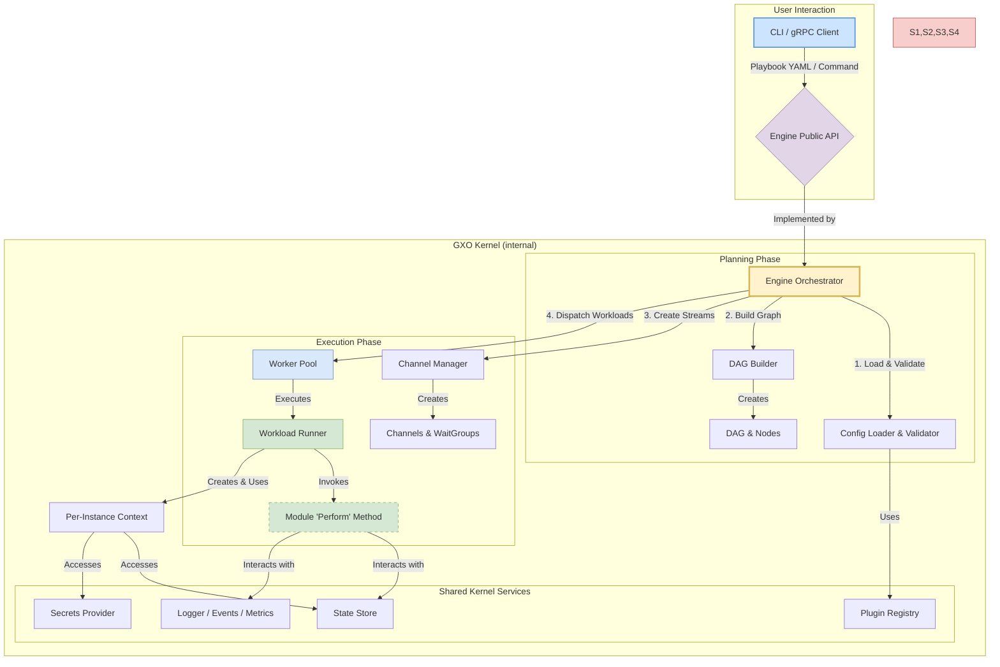

# **GXO Master Architecture & Design Specification**

**Document ID:** GXO-ARCH-MASTER
**Version:** 2.0
**Status:** Approved Technical Blueprint

## **Abstract**

GXO (Go Execution and Orchestration) is a system designed as a Declarative Automation Kernel. Drawing on foundational architectural principles from systems, network, software, and security engineering, GXO provides a secure, modular, and deterministic runtime. Its central purpose is to unify process supervision, event-driven orchestration, and streaming data flow into a single, high-performance, lightweight platform. The system is built upon a unified model where automation logic is declaratively bound to a specific execution policy, such as an ephemeral task, a supervised service, or an event-driven workflow. This document serves as the technical blueprint, defining the architecture, components, execution semantics, and security model for the GXO system.

---

## **Part I: The GXO Philosophy & Core Abstractions**

### **1.1. The Automation Kernel Paradigm**

GXO is architected as an Automation Kernel, a direct and intentional analogy to a modern operating system kernel. It does not perform high-level application logic itself; instead, it provides a minimal, privileged, and highly performant set of core services upon which all other functionality is built. This design philosophy mandates a clean separation between the Kernel's responsibilities and the responsibilities of the `Modules` it executes. The following sections detail how GXO's architecture natively fulfills the six defining responsibilities of this system class.

#### **1.1.1. Workload Management & Scheduling**
The Kernel is fundamentally responsible for managing the execution lifecycle of its primary schedulable entity, the `Workload`. It achieves this through a unified scheduler that understands diverse execution policies declared via a `Workload`'s `Lifecycle`. This includes constructing and executing a Directed Acyclic Graph (DAG) for ephemeral tasks (`run_once`), actively monitoring and restarting long-running services (`supervise`), and instantiating workflows in response to internal stream events or time-based triggers (`event_driven` & `scheduled`). Task readiness is resolved via the kernel’s channel and dependency resolution logic, ensuring that execution only begins when all declared inputs are satisfied or reachable.

#### **1.1.2. State Management & Isolation**
The Kernel provides a central, persistent, and concurrency-safe state store that serves as the "memory" for all workflows. Critically, it provides strong programmatic isolation between `Workloads`. By default, the `StatePolicy` dictates that all reads from the state store return a deep copy of the requested data. This is the direct analog of an OS kernel's virtual memory, preventing a misbehaving `Workload` from mutating shared state and causing non-deterministic failures. This state-copying behavior is enforced by default but may be policy-tuned to balance safety and performance for trusted, high-throughput workloads.

#### **1.1.3. Workspace & Artifact Management**
The Kernel abstracts the host filesystem into a secure, managed, and ephemeral execution environment called the `Workspace`. For each workflow instance, the Kernel creates a unique, isolated directory, performs all actions within it, and guarantees its secure deletion upon completion. This primitive provides a consistent filesystem for all `Workloads` within a run and is protected against path traversal attacks. Modules interacting with the filesystem write only to their ephemeral Workspace, ensuring artifacts are scoped and traceable to a specific workflow instance.

#### **1.1.4. A Native Module System**
The Kernel executes automation logic as trusted, in-process code via its native module system, which is analogous to an OS device driver model. Modules are not external scripts but integrated Go components that interact with the Kernel through a well-defined `Perform` method—the "system call" of the automation kernel. Each module’s interface is schema-validated at registration time, ensuring ABI stability and input/output contract integrity across releases. This native execution model is the Kernel's mechanism for interacting with all external "automation devices" like APIs, databases, and cloud platforms.

#### **1.1.5. Native Inter-Workload Communication (IPC)**
The Kernel provides built-in mechanisms for both state-based and stream-based communication between `Workloads`, eliminating the need for external message queues or fragile file-based data passing. State-based IPC allows a `Workload` to `register` its result, which becomes asynchronously available to any other `Workload`. For high-throughput data processing, the `stream_inputs` directive creates a native data stream between `Workloads` using efficient, in-memory Go channels. The kernel applies backpressure and buffering to these stream channels to ensure memory safety and throughput stability under high load, making it a direct analog of a Unix pipe.

#### **1.1.6. Security & Resource Protection**
The Kernel is responsible for enforcing security boundaries and protecting the host system. It achieves this by providing a declarative `security_context` that allows a `Workload`'s execution to be sandboxed. The `security_context` is declared per `Workload` and enforced at runtime, giving the operator granular control over a `Workload`'s blast radius via system call filtering (`seccomp`), resource limiting (`cgroups`), and filesystem, process, and network isolation (Linux namespaces).

### **1.2. Core Declarative Abstractions**

GXO's declarative language is built on a small, powerful set of orthogonal concepts. Understanding these is key to understanding the entire system.

#### **1.2.1. The `Workload`**
This is the top-level, declarative unit in a GXO playbook and the only object a user needs to define. It is the complete, schedulable entity that the GXO Kernel manages, representing the fusion of *what* to do and *how/when* to do it.

#### **1.2.2. The `Process`**
This is the reusable, inert definition of automation logic. It defines *what* a `Workload` does by composing a `module` (the implementation) and its `params` (the data). By separating the `Process` from its execution policy, the same logic can be used for a one-off task, a long-running service, or an event handler.

#### **1.2.3. The `Lifecycle`**
This is the execution policy that defines *how and when* the Kernel runs a `Process`. It is the second, mandatory part of a `Workload` definition. The standard lifecycles are `run_once`, `supervise`, `event_driven`, and `scheduled`.

---

## **Part II: Kernel-Level Primitives**

These are the fundamental, non-module capabilities provided by the `gxo` runtime itself. They are implemented by the Kernel to provide a secure, consistent, and stateful environment for all `Workloads`.

### **2.1. The `Workspace` Primitive**

A `Workspace` is a sandboxed filesystem context, isolated from the host and scoped to a specific `Workload`'s lifecycle. It is created upon workload instantiation and securely erased after termination, ensuring repeatability and preventing cross-contamination.

#### **2.1.1. Purpose & Scope**
The `Workspace` provides a clean and private filesystem to guarantee execution isolation and prevent side effects between concurrent workflows. A unique `Workspace` is created by the Kernel at the beginning of a workflow instance's execution. Every `Workload` within that specific DAG instance automatically executes with this directory as its current working directory. The absolute path to the `Workspace` is made available to all `Workloads` in the DAG via the built-in, read-only state variable `{{ ._gxo.workspace.path }}`. Upon terminal completion of the entire DAG, the Kernel guarantees the complete and recursive erasure of the `Workspace`.

#### **2.1.2. Security & Threat Mitigation**
The `Workspace` is a powerful primitive whose implementation is governed by strict security requirements. The Kernel enforces the sandbox by normalizing all file path parameters before invoking a module; any path that resolves outside the `Workspace` is rejected with a fatal security error. The `Workspace` directory name is cryptographically unpredictable (e.g., `/var/lib/gxo/workspaces/<UUID>`) and created with `0700` permissions owned exclusively by the `gxo` user, preventing data leakage. GXO is designed to operate within standard OS-level resource controls, and operational guidance recommends placing the parent `workspaces` directory on a partition where administrators can apply user or group quotas.

### **2.2. The `Resume Context` Primitive**

The `Resume Context` is the Kernel primitive that enables interactive, stateful workflows that must pause to cede control to an external agent—such as a human operator or another automated system—for approval or data injection. This is the canonical mechanism for implementing human-in-the-loop approval gates.

#### **2.2.1. Architectural Flow**
The process is an orchestrated sequence between a GXO module, the Kernel, and an external client:
1.  A `Workload` executes the `control:wait_for_signal` module, which signals its intent to pause.
2.  The Kernel responds by generating a unique, single-use resume token. It then takes a durable state snapshot of the workflow instance and persists it, associated with the token.
3.  The `Workload`'s execution is suspended, and the resume token is returned in its summary, where it can be passed to an external notification system.
4.  An operator or system uses a client like `gxo ctl resume` to send the token and a JSON `payload` (e.g., `{"approved": true, "reason": "LGTM"}`) to the `gxo daemon`'s control plane.
5.  The Kernel validates the token, retrieves the persisted state snapshot, and atomically merges the `payload` into the state within the reserved `_gxo.resume_payload` namespace.
6.  Finally, the Kernel signals its scheduler to "wake" the suspended `Workload`, which now resumes execution. Subsequent `Workloads` in the DAG can access the injected payload to perform conditional logic.

---

## **Part III: System Architecture & Execution Semantics**

### **3.1. High-Level Component Diagram**

The GXO Kernel is composed of several cooperative, specialized components that together orchestrate the execution of a playbook. The `DAGBuilder` translates declarative dependencies into a formal graph, the `ChannelManager` constructs the stream topology, and the `WorkloadRunner` manages the sandboxed execution of individual module invocations.

### **3.2. Detailed Execution Flow**

The execution of a GXO playbook is a multi-phase process managed by the Kernel, moving from high-level validation to the fine-grained execution of each `Workload`.

#### **3.2.1. Playbook Ingestion & Validation**
Before execution, the Kernel performs a rigorous, multi-step validation. This includes checking the raw YAML against the official GXO JSON Schema, performing a strict unmarshal into Go structs to reject unknown keys, and validating the logical integrity of the playbook (e.g., unique names, valid references, and well-formed policies).

#### **3.2.2. Execution Planning & DAG Construction**
The Kernel's `DAGBuilder` component analyzes the validated playbook to construct the execution graph. Dependencies are inferred automatically: implicit state dependencies are created by statically analyzing template variables, while explicit stream dependencies are created from the `stream_inputs` directive. The `ChannelManager` then instantiates the corresponding back-pressured Go channels. At the conclusion of this phase, the combination of the DAG and the resolved execution policies form a static and immutable "execution plan." This strict separation of planning from execution is a core architectural principle, guaranteeing that once a workflow begins, its logic cannot be mutated at runtime.

#### **3.2.3. Scheduling & Lifecycle Reconciliation**
Once the execution plan is finalized, the Kernel's scheduler begins execution based on each `Workload`'s declared `Lifecycle`. For `run_once` lifecycles, the scheduler dispatches ready nodes to a worker pool. For `supervise`, `event_driven`, or `scheduled` lifecycles, the `gxo daemon`'s internal reconciliation loops take ownership, continuously monitoring and instantiating workflows as required by the policy.

#### **3.2.4. Workload Execution & Module Invocation**
The `WorkloadRunner` is responsible for the "micro" execution of a single `Workload` instance. It creates an isolated, per-instance context, evaluates the `when` condition, and resolves any `loop` directives. It then renders all `params`, "tainting" any resolved secrets in its local `SecretTracker`. Finally, it invokes the appropriate module's `Perform` method—the "system call" of the Kernel—wrapped in the `retry` policy logic. After the `Perform` method returns a `summary`, the `WorkloadRunner` uses the `SecretTracker` to redact any tainted values before writing the result to the state store.

#### **3.2.5. State Transition & Teardown**
Upon a `Workload`'s completion (success, failure, or skip), its status is updated in the state store. This action signals any downstream dependents, potentially satisfying their dependencies and making them ready for scheduling. Once the entire DAG reaches a terminal state, the Kernel guarantees the final, secure deletion of the `Workspace`, ensuring no artifacts are left behind.

---

## **Part IV: Security Architecture**

GXO's security model is a foundational, non-negotiable aspect of its design, built on the principles of Defense in Depth, Zero Trust, and Supply Chain Integrity. Security is woven into every layer of the system to provide a defensible, auditable, and production-ready posture by default.

### **4.1. The Control Plane: Securing Administrative Access**
The interface between `gxo ctl` and the `gxo daemon` is the primary administrative attack surface. All communication with the daemon's gRPC endpoint must use Mutual TLS (mTLS), ensuring both client and server cryptographically verify each other's identity. The Kernel further implements a Role-Based Access Control (RBAC) system that authorizes actions based on the client certificate's verified identity, providing fine-grained control over who can apply, remove, or inspect workloads.

### **4.2. The Runtime: Hardening the Execution Environment**
The GXO runtime is hardened at multiple levels. A declarative `security_context` contains the blast radius of a potentially compromised `Workload` by orchestrating OS-level primitives like `seccomp`, `cgroups`, and Linux namespaces. To ensure supply chain integrity, the daemon can be configured with a `fail-closed` policy that requires all modules to have a valid cryptographic signature, preventing the execution of unauthorized or tampered code.

### **4.3. Data Security, Integrity, and Provenance**
GXO implements specific controls to protect sensitive data and provide a verifiable record of execution. The "Taint and Redact" system prevents accidental credential leakage by automatically redacting any `secret` value that is returned in a `Workload`'s summary or error message. For persistent deployments, the daemon's state file supports transparent encryption at rest using an AEAD cipher. Finally, each `Workload`'s lifecycle is tracked in an append-only execution log, including timestamped state transitions, operator-injected payloads (via `Resume Context`), and the precise module version executed. This provides a verifiable audit chain for regulatory environments.

---

## **Part V: Module Architecture & Composability**

### **5.1. The Module ABI Contract**
While GXO modules are Go packages, not traditional binaries, they adhere to a strict Application Binary Interface (ABI) contract enforced by the Kernel. This contract ensures that all modules behave predictably and interact with the Kernel in a secure and standardized way. The contract is defined by:
1.  **The `Perform` Method Signature:** The module must implement the `plugin.Module` interface, with a `Perform` method whose signature is fixed and versioned.
2.  **Structured `params`:** Modules receive their parameters in a structured `map[string]interface{}`. Module authors are expected to use the provided `paramutil` helpers for validation, ensuring consistent error handling.
3.  **Structured `summary`:** The data returned by a module for registration must be a serializable Go type.
4.  **Standardized Error Handling:** Modules must return standard Go errors, with specific `gxoerrors` types used to signal conditions like validation or record processing failures.
5.  **Context-Aware Execution:** Modules must respect the `context.Context` for cancellation and timeouts and must honor the `DryRunKey` to support simulation.

### **5.2. The GXO Automation Model (GXO-AM)**
GXO's power is made accessible through its layered module system, the GXO Automation Model (GXO-AM). Inspired by the OSI model for networking, the GXO-AM provides a principled stack that allows developers to solve problems at the most appropriate level of abstraction, composing powerful solutions upwards from simple primitives.

*   **Layer 6 (Integration):** Opinionated wrappers for ecosystem tools (`terraform:run`, `artifact:*`).
*   **Layer 5 (Application):** High-level service clients (`http:request`, `database:query`).
*   **Layer 4 (Data Plane):** Streaming ETL and transformation (`data:map`, `data:filter`, `data:join`).
*   **Layer 3 (Protocol):** Structured protocol logic (`http:listen`, `ssh:connect`).
*   **Layer 2 (Connection):** Raw network socket management (`connection:listen`, `open`).
*   **Layer 1 (System):** Direct OS and process control (`exec`, `filesystem:*`).
*   **Layer 0 (Kernel):** The GXO runtime providing scheduling, state, streams, and security.
