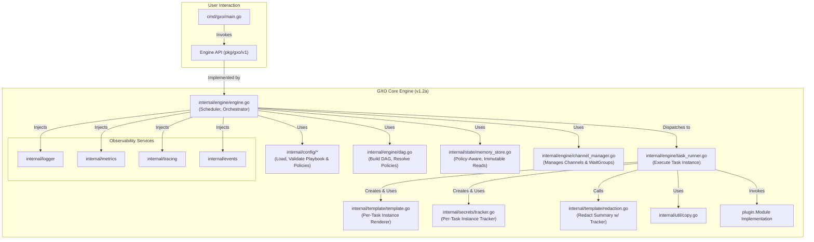

# **GXO Engine: Master Architecture & Design Specification (v0.1.2a)**

**Document ID:** GXO-ARCH-D-V0.1.2A
**Version:** 0.1.2a
**Date:** 2025-07-01
**Status:** CURRENT IMPLEMENTATION - DEPRECATED

** This document reflects the current state before the refactor and changes described in the ROADMAP. 

This document provides the detailed technical specification for the GXO v0.1.2a engine. It accurately describes the currently implemented features, which are based on the Task abstraction and the run_once lifecycle.

For the strategic vision, future architecture, and the evolution towards the unified Workload and LifecyclePolicy model, please refer to the GXO-ARCH-D-MASTER-FINAL whitepaper and the project ROADMAP.md.

**Document Goal:** To provide an exhaustive, unambiguous definition of the architecture, design, implementation details, algorithms, data structures, security model, and integrated testing strategy for the core GXO v0.1.2a engine. It synthesizes the project's high-level vision with the ground-truth of the implemented codebase, serving as the master technical blueprint.

## **Table of Contents**

1.  **Vision & Principles: The GXO Automation Kernel**
    *   1.1. Core Mandate: Speed, Reliability, Flexibility
    *   1.2. Design Philosophy: The Automation Kernel
    *   1.3. Core Abstractions: Workload & LifecyclePolicy
    *   1.4. The v0.1.2a Engine: The `run_once` Lifecycle Executor
2.  **System Architecture**
    *   2.1. High-Level Component Diagram & Interactions
    *   2.2. Detailed Execution Lifecycle & Data Flow
    *   2.3. Concurrency Model & Synchronization Primitives Specification
3.  **Core Component Design & Implementation Specification**
    *   3.1. Package: `cmd/gxo` - The Command-Line Interface
    *   3.2. Package: `internal/command` - Command Execution Abstraction
    *   3.3. Package: `internal/config` - Configuration Handling
    *   3.4. Package: `internal/engine` - Orchestration Core
    *   3.5. Package: `internal/events` - Decoupled Event System
    *   3.6. Package: `internal/logger` - Structured Logging
    *   3.7. Package: `internal/metrics` - Metrics Abstraction
    *   3.8. Package: `internal/module` - Module System Core
    *   3.9. Package: `internal/paramutil` - Parameter Validation
    *   3.10. Package: `internal/retry` - Resilient Execution
    *   3.11. Package: `internal/secrets` - Secret Tracking
    *   3.12. Package: `internal/state` - State Management
    *   3.13. Package: `internal/template` - Parameter Templating
    *   3.14. Package: `internal/tracing` - Distributed Tracing
    *   3.15. Package: `internal/util` - Core Utilities
    *   3.16. Package: `modules` - Core Modules
    *   3.17. Package: `pkg/gxo/v1` - Public API
4.  **Key Feature Implementation Details**
    *   4.1. Security: The "Taint and Redact" Secret Handling System
    *   4.2. State Management: The `StatePolicy` and Immutability Guarantee
    *   4.3. Streaming: `WaitGroup`-based Stream Synchronization
5.  **Algorithm & Data Structure Validation**
    *   5.1. DAG Representation & Traversal
    *   5.2. Deep Copy Algorithm Validation (Cycle Safety)
    *   5.3. Concurrency Control Primitives Rationale
6.  **Integrated Testing & Benchmarking Strategy**
    *   6.1. Unit Testing Specification
    *   6.2. Integration Testing Specification
    *   6.3. Benchmark Suite Specification
7.  **Glossary of Terms**

---

## **1. Vision & Principles: The GXO Automation Kernel**

### **1.1. Core Mandate: Speed, Reliability, Flexibility**
The GXO engine is engineered to be a high-performance automation kernel. Its design prioritizes:
*   **Speed:** Minimizing execution overhead and latency through efficient Go implementation, concurrent execution, and native data streaming.
*   **Reliability:** Ensuring predictable, deterministic execution. The engine must handle errors gracefully, provide clear diagnostics, and maintain internal consistency through robust concurrency control and a secure-by-default state model.
*   **Flexibility:** Providing a powerful, composable set of primitives that can be combined to solve a wide range of automation challenges, with policy-driven escape hatches for advanced use cases.

### **1.2. Design Philosophy: The Automation Kernel**
GXO is architected as a foundational **Automation Kernel**. This is a direct analogy to an operating system kernel. It does not perform high-level application logic itself; instead, it provides a minimal, privileged, and highly performant set of core services—scheduling, state management, process isolation, and inter-process communication (streaming)—upon which all other functionality is built.

### **1.3. Core Abstractions: Workload & LifecyclePolicy**
The GXO vision is built on two powerful abstractions that unify previously disparate concepts like "tasks," "services," and "jobs."
*   A **`Workload`** is the atomic unit of automation in GXO. It is a declarative definition of a behavior, composed of its `params` (interface), `module` (implementation), and `summary`/`status` (state).
*   A **`LifecyclePolicy`** is an explicit, declarative policy that instructs the kernel on *how* to manage a Workload's execution over time (e.g., `run_once`, `supervise`, `event_driven`).

### **1.4. The v0.1.2a Engine: The `run_once` Lifecycle Executor**
The current `gxo` v0.1.2a engine is the stable, feature-complete implementation of the **`run_once` lifecycle executor**. In the current schema, a `Workload` with a `run_once` lifecycle is called a **`Task`**. The `gxo` binary functions as the ephemeral executor (`gxo run`) for these tasks, providing the foundational kernel upon which future lifecycle policies and operational modes (`gxo daemon`, `gxo ctl`) will be built.

---

## **2. System Architecture**

### **2.1. High-Level Component Diagram & Interactions**

### **2.2. Detailed Execution Lifecycle & Data Flow**
1.  **Initialization (`cmd/gxo/main.go`):** The `main` function parses CLI flags, initializes all core services (Logger, StateStore, PluginRegistry, etc.), and injects them into the `engine.NewEngine` constructor. It sets up OS signal handling to trigger a graceful shutdown via context cancellation.
2.  **Playbook Loading (`engine.RunPlaybook`):** The engine receives the playbook YAML. `config.LoadPlaybook` performs a 5-step validation: 1) JSON Schema validation, 2) Strict unmarshalling into structs, 3) `schemaVersion` compatibility check, 4) Logical structure validation, 5) Internal ID assignment.
3.  **Execution Planning:**
    *   `engine.BuildDAG` is called. It creates a `Node` for each task and performs **Policy Resolution**, determining the final `StatePolicy` for each node by layering global and task-specific policies. It then builds the dependency graph based on `stream_inputs`, `register`, and `_gxo.tasks` references, and checks for cycles.
    *   `engine.ChannelManager.CreateChannels` is called. It walks the DAG and creates a buffered Go channel for each streaming link and a `sync.WaitGroup` for each producer task to enable stream synchronization.
4.  **Execution Phase:**
    *   The `Engine` starts a pool of worker goroutines.
    *   The main scheduler loop identifies ready tasks (zero dependencies) and dispatches them to the `workQueue`.
    *   A worker goroutine picks up a task ID and calls `runTaskAndHandleCompletion`.
5.  **Task Execution (`runTaskAndHandleCompletion` -> `TaskRunner`):**
    *   A new `secrets.SecretTracker` and `template.GoRenderer` are created for the specific task instance, ensuring execution isolation.
    *   The `TaskRunner` evaluates the `when` condition.
    *   It resolves `loop` items and manages the parallel execution of `executeSingleTaskInstance`.
    *   `executeSingleTaskInstance` renders parameters using the task-local renderer. During this process, any calls to the `secret` function "taint" the `SecretTracker`.
    *   It invokes the module's `Perform` method, wrapped in retry logic.
    *   After `Perform` completes, if the `register` directive is present, `RedactTrackedSecrets` is called to sanitize the summary using the `SecretTracker`'s data before writing to the state store.
6.  **Completion & Teardown:** When a task finishes, `handleTaskCompletion` updates its status, signals its dependents, and the cycle repeats. The playbook ends when all tasks are in a terminal state or a fatal error occurs.

### **2.3. Concurrency Model & Synchronization Primitives Specification**
*   **Workers:** A `workerPoolSize`-limited pool of goroutines consumes tasks from a `workQueue` channel.
*   **Task Scheduling Channels:** `workQueue` and `readyChan` decouple the scheduler from the workers. A `fatalErrChan` signals a playbook halt.
*   **Stream Synchronization (`sync.WaitGroup`):** This is the primary mechanism for robust streaming. A `WaitGroup` is created per producer task. Each of its consumers increments the group counter. The producer's `TaskRunner` waits on this group in a background goroutine after closing its output channels, ensuring it doesn't terminate until all consumers have finished reading.
*   **Shared State Protection:** `sync.RWMutex` protects shared maps (`taskStatuses`, caches). `atomic.Int32` is used for lock-free decrementing of dependency counters (`DepsRemaining`), which is a performance optimization.

---

## **3. Core Component Design & Implementation Specification**

### **3.1. Package: `cmd/gxo` - The Command-Line Interface**
*   **Purpose:** The main entry point for the `gxo` application. Handles command-line argument parsing and orchestrates the setup and teardown of the engine.
*   **`main.go`:**
    *   **`main()`:** Parses top-level commands like `validate` or `execute` (default) and dispatches to the appropriate handler function. Handles the `--version` flag.
    *   **`printVersion()`:** Prints detailed version, commit, and build information to standard output.
    *   **`runValidateCommand(...)`:** Handles the `gxo validate` subcommand. It parses flags, loads the playbook using `config.LoadPlaybook` (which performs all validation), and reports success or failure.
    *   **`runExecuteCommand(...)`:** The primary function for `gxo [execute]`. It initializes all services (logger, state store, providers), instantiates the `engine.Engine` with these services via functional options, sets up context and signal handling, calls `engine.RunPlaybook`, and handles final reporting and exit codes.
    *   **`printReportSummary(...)`, `logFailedTasks(...)`, `determineExitCode(...)`:** Helper functions to format and log the final `ExecutionReport` and translate it into a standard POSIX exit code.

### **3.2. Package: `internal/command` - Command Execution Abstraction**
*   **Purpose:** Provides a testable abstraction for running external shell commands, used by the `exec` module.
*   **`command.go`:**
    *   **`Runner` interface:** Defines the `Run` method, decoupling the `exec` module from the standard `os/exec` package.
    *   **`defaultRunner` struct & `NewRunner()`:** The standard implementation of the `Runner` interface and its constructor.
    *   **`Run(...)` method:** Uses `exec.CommandContext` to create a command that respects context cancellation. It captures `stdout` and `stderr` and correctly interprets the `*exec.ExitError` to distinguish between command execution failures and non-zero exit codes.

### **3.3. Package: `internal/config` - Configuration Handling**
*   **Purpose:** Defines the playbook schema as Go structs and handles loading and validation of YAML files.
*   **`config.go`:** Defines all structs mirroring the playbook YAML structure (`Playbook`, `Task`, `RetryConfig`, etc.), including policy objects.
*   **`policy.go`:** Defines the `StatePolicy`, `StateAccessMode`, and `StallPolicy` structs, separating policy definitions from the main configuration.
*   **`load.go`:**
    *   **`LoadPlaybook`:** Orchestrates the 5-step loading and validation process.
    *   **`assignInternalTaskIDs`:** Assigns a unique `InternalID` to each task for use by the engine.
    *   **`yamlUnmarshalStrict`:** A wrapper around `yaml.Decoder` that enables `KnownFields(true)` to reject playbooks with unknown keys.
*   **`schema.go`:**
    *   **`gxo_schema_v1.0.0.json`:** The embedded JSON Schema definition for playbook structure.
    *   **`ValidateWithSchema`:** Validates a YAML document against the embedded JSON Schema.
*   **`validation.go`:**
    *   **`ValidatePlaybookStructure`:** Performs deep, logical validation on the parsed `Playbook` struct, checking for unique names, valid references, and dependency sanity that cannot be expressed in JSON Schema.

### **3.4. Package: `internal/engine` - Orchestration Core**
*   **Purpose:** Contains the main orchestration logic, including the scheduler, DAG builder, and worker pool.
*   **`engine.go`:**
    *   **`Engine` struct:** The central object holding all services, policies, and runtime state.
    *   **`NewEngine`:** Constructor that initializes the `Engine` and all its sub-components, applying functional options.
    *   **`RunPlaybook`:** The main entry point. Orchestrates the entire lifecycle as detailed in section 2.2.
    *   **`worker`:** The goroutine for the worker pool. It consumes from the `workQueue` and dispatches to `runTaskAndHandleCompletion`.
    *   **`runTaskAndHandleCompletion`:** The bridge between the scheduler and the `TaskRunner`. It creates the per-task `GoRenderer` and `SecretTracker` and passes them to the `TaskRunner`.
    *   **`handleTaskCompletion`:** A thread-safe method to update task status, record metrics, and signal dependents.
*   **`dag.go`:**
    *   **`BuildDAG`:** Implements the multi-pass algorithm for building the dependency graph, resolving policies, calculating dependency counts, and detecting cycles.
*   **`channel_manager.go`:**
    *   **`ChannelManager` struct:** Manages the lifecycle of data channels and their associated synchronization `WaitGroup`s.
    *   **`CreateChannels`:** Builds the entire streaming topology based on the DAG.
*   **`task_runner.go`:**
    *   **`TaskRunner` struct:** Holds dependencies needed to run a task instance.
    *   **`ExecuteTask`:** Manages the execution of a single task, handling `when`, `loop`, timeouts, and final result/secret registration.
    *   **`executeSingleTaskInstance`:** Executes one specific invocation of a module's `Perform` method, wrapped in retry logic.

### **3.5. Package: `internal/events` - Decoupled Event System**
*   **Purpose:** Provides an in-process, decoupled eventing system.
*   **`channel_bus.go`:** An implementation of the `events.Bus` interface using a non-blocking, buffered Go channel.
*   **`metrics_listener.go`:** A concrete event consumer that listens to the bus and updates Prometheus metrics (e.g., for secret access).
*   **`noop_bus.go`:** A null implementation of `events.Bus` that serves as a safe default.

### **3.6. Package: `internal/logger` - Structured Logging**
*   **Purpose:** Provides a structured logging implementation based on Go's standard `slog` library.
*   **`logger.go`:**
    *   **`defaultLogger`:** An implementation of the public `gxolog.Logger` interface.
    *   **`NewLogger`:** A factory function to create a new logger with configurable level and format (text/json).
    *   **`OtelHandler`:** A `slog.Handler` middleware that automatically injects OpenTelemetry `trace_id` and `span_id` into every log record.

### **3.7. Package: `internal/metrics` - Metrics Abstraction**
*   **Purpose:** Provides the concrete implementation for the metrics provider interface.
*   **`provider.go`:** Implements `metrics.RegistryProvider` using a standard `*prometheus.Registry`.

### **3.8. Package: `internal/module` - Module System Core**
*   **Purpose:** Defines internal module system concepts and the compile-time registry.
*   **`module.go`:** Defines internal-only concepts like `DryRunKey` and `ExecutionContext` for hooks.
*   **`registry.go`:** Implements the `plugin.Registry` interface via `StaticRegistry`, which is populated at compile time by modules using `init()` functions.

### **3.9. Package: `internal/paramutil` - Parameter Validation**
*   **Purpose:** Provides a suite of helper functions for modules to safely and consistently validate their `params` map.
*   **`paramutil.go`:** Contains functions like `GetRequiredString`, `GetOptionalStringSlice`, `CheckRequired`, `CheckExclusive`, etc., which return typed values or a standard `ValidationError`.

### **3.10. Package: `internal/retry` - Resilient Execution**
*   **Purpose:** Implements a generic, configurable retry mechanism.
*   **`retry.go`:** The `Helper.Do` function implements the full retry algorithm with support for attempts, delay, exponential backoff, jitter, and context cancellation.

### **3.11. Package: `internal/secrets` - Secret Tracking**
*   **Purpose:** Contains the logic for tracking resolved secrets during a task's execution.
*   **`env_provider.go`:** The default `secrets.Provider` implementation, which reads secrets from environment variables.
*   **`tracker.go`:** Defines the `SecretTracker` struct, which uses a map to store "tainted" secret values for a single task run. It is concurrency-safe.
*   **`tracker_test.go`:** Provides unit tests for the `SecretTracker`.

### **3.12. Package: `internal/state` - State Management**
*   **Purpose:** Contains the concrete implementation of the in-memory state store.
*   **`store.go`:** Defines the internal `StateStore` interface, which extends the public `StateReader`.
*   **`memory_store.go`:** Implements the `StateStore` interface using a `sync.RWMutex`-protected map. Its `Get` and `GetAll` methods use the `util.DeepCopy` function to enforce immutability.
*   **`memory_store_bench_test.go`:** Provides benchmarks validating the performance of the deep copy implementation.

### **3.13. Package: `internal/template` - Parameter Templating**
*   **Purpose:** Implements the `Renderer` interface and provides template-related utilities.
*   **`template.go`:** Defines the `GoRenderer`, which is instantiated per-task to correctly bind to a `SecretTracker`. It handles rendering, resolution, variable extraction, and template caching.
*   **`funcs.go`:** Defines the `GetFuncMap` factory and its helper functions (`funcEnv`, `createSecretFunc`). It is also now the canonical location for the keyword-based `RedactSecretsInError`.
*   **`redaction.go`:** Contains the `RedactTrackedSecrets` function, which performs the recursive redaction of task summaries using a `SecretTracker`.
*   **`redaction_test.go`:** Provides unit tests for the `RedactTrackedSecrets` function.

### **3.14. Package: `internal/tracing` - Distributed Tracing**
*   **Purpose:** Implements the `TracerProvider` interface using the OpenTelemetry SDK.
*   **`provider.go`:** Handles the complex logic of setting up an OTel provider and exporter based on standard environment variables, with a safe fallback to a `NoOpProvider`.
*   **`tracing.go`:** Provides tracing utility functions, including `RecordErrorWithContext`, which safely records redacted errors on OTel spans.

### **3.15. Package: `internal/util` - Core Utilities**
*   **Purpose:** Contains general-purpose utility functions.
*   **`copy.go`:** Implements the high-performance, cycle-safe hybrid `DeepCopy` algorithm, a cornerstone of GXO's state management safety.

### **3.16. Package: `modules` - Core Modules**
*   **Purpose:** Contains the implementations of GXO's built-in "standard library" of modules.
*   **`exec/exec.go`:** Implements the `exec` module for running local commands.
*   **`generate/from_list/from_list.go`:** Implements a producer module that generates a stream from a static list.
*   **`passthrough/passthrough.go`:** Implements a fundamental streaming utility that reads from all inputs and writes to all outputs, essential for pipelines.
*   **`stream/join/join.go`:** Implements a two-phase hash join for combining data from multiple streams.
*   **`test/producer/producer.go`:** A simple producer module used for testing.

### **3.17. Package: `pkg/gxo/v1` - Public API**
*   **Purpose:** Defines all the public interfaces and data structures that GXO exposes for use as a library. This creates a stable contract for programmatic users and separates the public API from internal implementation details. Each sub-package (`errors`, `events`, `log`, `metrics`, `plugin`, `secrets`, `state`, `tracing`) defines the relevant interfaces and types for its domain.

---

## **4. Key Feature Implementation Details**

### **4.1. Security: The "Taint and Redact" Secret Handling System**
This critical security feature operates in a precise sequence orchestrated by the `TaskRunner`:
1.  **Instantiation:** For each task instance, a new `secrets.SecretTracker` and a `template.GoRenderer` are created. The tracker is passed to the renderer during construction.
2.  **Tainting:** The renderer's `secret` function is a closure that captures this specific tracker. When `{{ secret 'KEY' }}` is called during parameter rendering, this function resolves the secret and calls `tracker.Add()` on the raw value, "tainting" it.
3.  **Sanitization:** After the module's `Perform` method returns a summary, the `TaskRunner` calls `template.RedactTrackedSecrets`, passing the summary and the same `SecretTracker` instance.
4.  **Redaction:** This function recursively scans the summary. If any string value contains a "tainted" secret from the tracker, it is replaced with `[REDACTED_SECRET]`.
5.  **Registration:** Only the sanitized summary is written to the state store via `stateManager.Set()`.

### **4.2. State Management: The `StatePolicy` and Immutability Guarantee**
1.  **Declaration:** A user can declare a `state_policy` at the playbook or task level to control state access.
2.  **Resolution:** The `DAGBuilder` calculates the final, effective `StatePolicy` for each task by layering the global and task-specific policies and stores it on the `Node`.
3.  **Enforcement:** The `TaskRunner` creates a `policyAwareStateReader` for each task, configured with the node's resolved `StatePolicy`. The underlying `MemoryStateStore` *always* performs a deep copy for maximum safety. The `policyAwareStateReader` is the architectural point where a future "unsafe" mode would bypass this copy.

### **4.3. Streaming: `WaitGroup`-based Stream Synchronization**
1.  **Setup:** During `channelManager.CreateChannels`, a `sync.WaitGroup` is created for each producer task. For every consumer that lists that producer as an input, the producer's `WaitGroup` counter is incremented by one.
2.  **Producer Logic:** After a producer's `Perform` method finishes successfully, the `TaskRunner` closes its output channels to signal End-of-Stream. It then starts a non-blocking background goroutine that calls `wg.Wait()` on the producer's own `WaitGroup`. The main execution path of the producer task does not block.
3.  **Consumer Logic:** After a consumer's `Perform` method finishes (on any path: success, failure, or panic), a `defer` block in the `TaskRunner` calls `wg.Done()` on the `WaitGroup`s of *all* its producers.
4.  **Result:** This ensures that a producer task's background wait will only unblock after all of its consumers have finished processing, preventing race conditions and ensuring the entire stream lifecycle completes cleanly and in the correct order.

---
## **5. Algorithm & Data Structure Validation**

### **5.1. DAG Representation & Traversal**
*   **Representation:** The DAG is an adjacency list implemented with `map[string]*Node`.
*   **Correctness:** This is a standard and efficient representation. Cycle detection is performed with a standard DFS algorithm.

### **5.2. Deep Copy Algorithm Validation (Cycle Safety)**
*   **Algorithm:** The hybrid `DeepCopy` in `internal/util/copy.go` uses a fast path for common types (`map[string]interface{}`, `[]interface{}`) and a reflection-based fallback.
*   **Cycle Safety:** It uses a `map[uintptr]interface{}` (the `CycleDetectionContext`) to track object memory addresses. Before copying a pointer-like type, it checks if the address has been seen. If so, it returns the existing copy, breaking the cycle. This "memoization" approach is a standard and robust method for handling cycles in graph traversal, guaranteeing termination.
*   **Performance:** Benchmarks in `memory_store_bench_test.go` confirm this hybrid approach is significantly more performant than pure reflection, justifying it as a safe and fast default.

### **5.3. Concurrency Control Primitives Rationale**
*   **`sync.RWMutex`:** Used for shared maps (caches, registries) where reads are more frequent than writes, allowing concurrent reads.
*   **`atomic.Int32`:** Used for the `DepsRemaining` counter for high-performance, lock-free updates.
*   **`chan`:** Used for communication between the scheduler and workers, avoiding shared state and complex locking for the core scheduling flow.

---
## **6. Integrated Testing & Benchmarking Strategy**

### **6.1. Unit Testing Specification**
*   All core packages now have `_test.go` files with unit tests covering happy paths, boundary cases, error cases, and concurrency safety (`-race` flag). Key areas covered include the `SecretTracker`, `Redaction` logic, and `StatePolicy` handling.

### **6.2. Integration Testing Specification**
*   The `engine_test.go` suite covers end-to-end playbook execution for state passing, conditionals, failures, and context cancellation.
*   The `engine_policy_test.go` suite validates the enforcement of `StatePolicy`.
*   The `engine_security_test.go` suite validates the end-to-end "Taint and Redact" feature.
*   The `modules/stream/join/join_test.go` suite validates the complex stream synchronization logic.

### **6.3. Benchmark Suite Specification**
*   `internal/state/memory_store_bench_test.go` provides a comprehensive benchmark of state access performance under different strategies, validating the "F1 Spec" design choices.

---
## **7. Glossary of Terms**
*   **Automation Kernel:** The core GXO engine responsible for scheduling, state management, and execution of workloads.
*   **DAG (Directed Acyclic Graph):** The internal model of task dependencies.
*   **LifecyclePolicy:** A future declarative policy (`run_once`, `supervise`) defining how the kernel manages a Workload's execution.
*   **Module (`plugin.Module`):** The fundamental, reusable unit of execution logic in GXO.
*   **SecretTracker:** A per-task, in-memory object that tracks resolved secret values for the purpose of redaction.
*   **Tainting:** The process of marking a resolved secret value within a `SecretTracker`.
*   **Task:** The current implementation of a `run_once` Workload.
*   **Workload:** The core architectural abstraction for a unit of automation.
