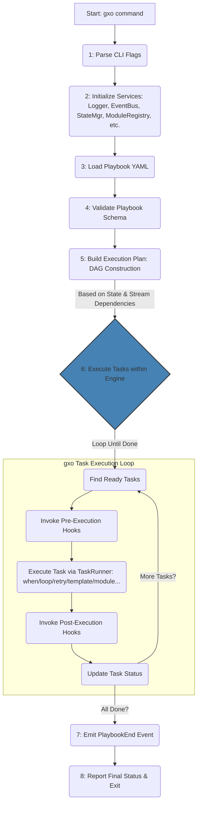

## `gxo` Architecture Reference - Understanding the Automation Kernel (V0.1 Alpha Engine)

**Version:** 1.2 (Based on `gxo` Engine V0.1 Alpha Spec)
**Audience:** Developers, DevOps Engineers, Automation Specialists

**Table of Contents:**

1.  **Introduction: The GXO Platform and the `gxo` Automation Kernel**
    *   1.1. What Problem Does the GXO Platform Aim to Solve?
    *   1.2. The Kernel Philosophy: Focus on `gxo`
    *   1.3. Core Principles of the `gxo` Engine
    *   1.4. Who Should Read This Document?
    *   1.5. Key Terminology (GXO vs. `gxo`)
2.  **The Big Picture: `gxo` Playbook Execution Lifecycle**
    *   2.1. From YAML to Running Tasks with `gxo`
    *   2.2. High-Level Phases
3.  **Deep Dive: The `gxo` Core Engine Components**
    *   3.1. Configuration Loading & Validation (`internal/config`)
    *   3.2. State Management: The Kernel's Memory (`internal/state`)
    *   3.3. Modularity: Extending the Kernel (`internal/module`)
    *   3.4. DAG Construction: Planning the Execution (`internal/engine/dag.go`)
    *   3.5. Channel Management: Orchestrating Data Streams (`internal/engine/channel_manager.go`)
    *   3.6. Task Execution: The Workhorse (`internal/engine/task_runner.go`)
        *   3.6.1. The `when` Clause: Conditional Execution
        *   3.6.2. The `loop` Directive: Iteration and Parallelism
        *   3.6.3. Parameter Templating (`internal/template`)
        *   3.6.4. Module Invocation (`Module.Perform`)
        *   3.6.5. Channel Wiring and Data Flow
        *   3.6.6. The `retry` Mechanism (`internal/retry`)
        *   3.6.7. Result Registration (`register`)
        *   3.6.8. Dry Run Mode (`-dry-run`)
    *   3.7. Error Handling: Resilience and Reporting (`internal/errors`)
4.  **Advanced Architectural Concepts (Foundation in `gxo` V0.1)**
    *   4.1. Execution Lifecycle Hooks
        *   4.1.1. Example Hook Usage
    *   4.2. The Event Bus
        *   4.2.1. Example Event Bus Usage
        *   4.2.2. Example Event Payloads
    *   4.3. Future Policies & Capabilities
        *   4.3.1. Example Policy Use Cases
5.  **Design Philosophy & Trade-offs of the `gxo` Engine**
    *   5.1. Why Go?
    *   5.2. Why Streaming Native (Channels)?
    *   5.3. Why Native State (`interface{}`)?
    *   5.4. Why Compile-Time Modules (Initially)?
    *   5.5. Why Go `text/template` (Initially)?
6.  **Extending `gxo`: Module Development Basics**
7.  **Glossary**

---

**1. Introduction: The GXO Platform and the `gxo` Automation Kernel**

**1.1. What Problem Does the GXO Platform Aim to Solve?**

Modern IT and development workflows often involve orchestrating complex sequences of tasks across diverse systems: interacting with APIs, transforming data, managing infrastructure, running commands, and reacting to events. The **GXO Platform** aims to provide a comprehensive, performant, and flexible solution for these challenges. Existing tools often excel in niches but struggle when combining diverse tasks efficiently, especially with large data volumes. The GXO platform seeks to address performance bottlenecks, limited composability, architectural rigidity, and complexity in automation.

**1.2. The Kernel Philosophy: Focus on `gxo`**

At the heart of the GXO platform lies **`gxo`**, the core **Automation Kernel**.

> **Definition**: An Automation Kernel is a lightweight, extensible core runtime designed to execute orchestrated tasks, services, and data pipelines across diverse environments. It provides foundational automation services—task execution, dependency management, data transport (streaming), templating, state management—as composable primitives, exposing a modular API for building higher-level capabilities.

Unlike monolithic platforms, the `gxo` engine focuses on being the best possible execution core. It provides the essential, performant services that allow complex automation workflows to run reliably. It is the foundation upon which the broader GXO platform (including the future `gxod` daemon and `gxoctl` control utility) will be built. This document focuses specifically on the architecture of the `gxo` engine and its associated command-line interface as defined in the V0.1 Alpha specification.

**1.3. Core Principles of the `gxo` Engine**

*   **Streaming Native:** Designed for efficient, low-latency data flow between tasks using Go channels.
*   **Modularity & Composability:** Functionality delivered via discrete **Modules**, enabling workflows built by composition. A **Tiered Hierarchy** guides module development.
*   **Performance:** Leverages Go's concurrency and efficiency.
*   **Declarative Execution:** Workflows defined in YAML Playbooks; `gxo` manages execution.
*   **Extensibility:** Clear interfaces and hooks (Modules, Execution Hooks, Event Bus) integrated into the engine.
*   **Observability:** Foundational hooks and events built-in for monitoring and tracing.

**1.4. Who Should Read This Document?**

This document is for anyone seeking a deeper understanding of the **`gxo` engine's** internal workings:

*   **Developers** creating new GXO modules or contributing to the `gxo` core engine.
*   **DevOps Engineers / SREs** deploying and operating `gxo` (or the future GXO platform) who want to understand its performance characteristics and behavior.
*   **Automation Specialists** designing complex playbooks for `gxo` who want to leverage its full potential.

**1.5. Key Terminology (GXO vs. `gxo`)**

*   **GXO (Platform):** The overall ecosystem encompassing `gxo`, `gxod`, `gxoctl`, modules, documentation, etc.
*   **`gxo` (Engine/CLI):** The core **Automation Kernel** responsible for playbook execution *and* the command-line tool (`cmd/gxo`) used to run it directly. This is the primary subject of this document.
*   **`gxod` (Daemon):** Future component: A long-running service for API-driven execution, scheduling, etc.
*   **`gxoctl` (Control CLI):** Future component: A CLI tool to interact with `gxod`.
*   **Kernel:** Refers specifically to the core engine logic within `gxo`.
*   **Playbook:** A YAML file defining a workflow for the `gxo` engine.
*   **Task:** A single unit of work within a playbook, executed by a Module within the `gxo` engine.
*   **Module:** A self-contained Go package implementing a specific capability, loaded and run by the `gxo` engine (e.g., `exec`).
    *   **Primitive Module (Tier 1):** Provides foundational capabilities (e.g., command execution, file system access).
    *   **Service Module (Tier 2+):** Builds upon primitives for higher-level tasks (e.g., API interaction, database access).
*   **DAG (Directed Acyclic Graph):** The internal representation of tasks and their dependencies used by the `gxo` engine to determine execution order.
*   **State:** The central, in-memory data store within the `gxo` engine, holding playbook variables, registered task results, and task status.
*   **Channel:** A Go channel (`chan map[string]interface{}`) used by the `gxo` engine for streaming data (`Records`) between tasks.
*   **Record:** A single data item, typically `map[string]interface{}`, flowing through a `Channel`.
*   **Context (`context.Context`):** Carries cancellation signals, deadlines, and request-scoped values like `DryRunKey` through the `gxo` engine and into modules.
*   **Dry Run:** `gxo` execution mode simulating actions without performing side effects, triggered by the `-dry-run` flag.
*   **Event:** A structured notification (`events.Event`) emitted via the `gxo` engine's internal Event Bus.
*   **Event Bus:** An internal interface (`events.EventBus`) within `gxo` for broadcasting Events.
*   **Execution Hook:** An interface (`module.ExecutionHook`) allowing code injection before and after task execution within `gxo`.

---

**2. The Big Picture: `gxo` Playbook Execution Lifecycle**

**2.1. From YAML to Running Tasks with `gxo`**

When you execute the `gxo` command (`gxo -playbook my_playbook.yml`), the **`gxo` engine** takes the declarative playbook definition and orchestrates its execution according to the defined dependencies and directives.

**2.2. High-Level Phases**

The execution process within the `gxo` process can be broken down as follows:



1.  **Initialization:** The `gxo` CLI parses command-line arguments and initializes essential engine services. This includes setting up logging, the state manager (in-memory for V0.1), the module registry, and the internal event bus (using a no-op implementation initially).
2.  **Load & Validate:** The engine reads the specified playbook YAML file, parses it into internal Go structures, and validates the structure against the defined schema, ensuring required fields and basic logic are sound.
3.  **Build DAG:** The engine analyzes task definitions to map out dependencies. It looks at `stream_input` directives for data flow dependencies and parses templates (`params`, `when`, `loop`) for state-based dependencies (where one task uses the registered result or status of another). This creates the Directed Acyclic Graph (DAG) and checks for invalid circular dependencies.
4.  **Prepare Channels:** If the DAG indicates streaming dependencies, the engine's `ChannelManager` creates the necessary buffered Go channels to connect producer and consumer tasks.
5.  **Execute Tasks:** The engine enters its main execution loop. It repeatedly identifies tasks whose dependencies are satisfied (status `Completed` or `Skipped`) based on the DAG. For each ready task:
    *   Registered `BeforeExecute` hooks are invoked.
    *   The `TaskRunner` takes over, handling specific task directives (`when`, `loop`, `retry`), rendering parameters via the template engine, invoking the correct module's `Perform` method, and managing data flow through channels.
    *   Registered `AfterExecute` hooks are invoked.
    *   The task's final status is recorded.
    *   Relevant events are emitted via the internal Event Bus.
    *   Error handling logic determines if execution should continue or halt based on the error and the `ignore_errors` flag.
6.  **Completion:** Once all tasks reach a terminal state (`Completed`, `Failed`, or `Skipped`), the engine loop terminates, a final `PlaybookEnd` event is emitted, the outcome is logged, and the `gxo` process exits with an appropriate status code.

---

**3. Deep Dive: The `gxo` Core Engine Components**

**3.1. Configuration Loading & Validation (`internal/config`)**

*   **Responsibility:** Defines the authoritative Go structs representing the playbook schema, loads YAML into these structures, and performs initial validation.
*   **How it Works:** Uses standard Go YAML libraries. `config.go` holds struct definitions reflecting the full schema, including placeholders for future policy features. `load.go` reads and unmarshals the file. `validation.go` checks structural integrity, required fields, and basic logical consistency (e.g., requiring `task.name` if `register` is used). V0.1 Alpha validation enforces current implementation limits (e.g., single stream input source).

**3.2. State Management: The Kernel's Memory (`internal/state`)**

*   **Responsibility:** Provides the `gxo` engine's central, thread-safe store for shared runtime data, distinct from bulk data streams.
*   **Purpose:** Stores initial playbook `vars`, task results via `register`, final task status (`_gxo.tasks...`), and provides data for templating and `when` conditions.
*   **How it Works:** The `Manager` provides thread-safe access (read-write locks) to an underlying `StateStore`. V0.1 Alpha uses an `MemoryStateStore` holding native Go `interface{}` types. Modules get a read-only `StateReader` interface.
*   **Key Consideration (Mutability):** Retrieving complex types (maps/slices) from the `MemoryStateStore` yields references. Consumers **must treat these as immutable** to prevent side effects.

**3.3. Modularity: Extending the Kernel (`internal/module`)**

*   **Responsibility:** Defines the `module.Module` interface contract for all task implementations and manages the registry of available modules.
*   **The Module Interface:** `Perform(ctx context.Context, params map[string]interface{}, stateReader state.StateReader, input <-chan map[string]interface{}, outputChans []chan<- map[string]interface{}, errChan chan<- error) (summary interface{}, err error)` is the core method. Modules receive context, parameters, state access, and channels, returning a summary and/or fatal error.
*   **Registration:** Compile-time registration via `init()` functions calling `module.Register`. The engine instantiates modules via registered factory functions.
*   **Tiered Hierarchy Vision:** Modules conceptually belong to tiers (Tier 1 Primitives, Tier 2+ Services) to encourage structured design and reuse.

**3.4. DAG Construction: Planning the Execution (`internal/engine/dag.go`)**

*   **Responsibility:** Builds the Directed Acyclic Graph (DAG) representing task dependencies within the `gxo` engine.
*   **How it Works:** Analyzes `task.StreamInput.Sources` for channel-based dependencies and parses templates in `params`, `when`, `loop` for state/status dependencies. Detects cycles using DFS. The DAG determines task readiness based on dependency statuses (`Completed`/`Skipped` required, `Failed` blocks).

**3.5. Channel Management: Orchestrating Data Streams (`internal/engine/channel_manager.go`)**

*   **Responsibility:** Creates and manages Go channels (`chan map[string]interface{}`) for tasks linked by `stream_input`.
*   **How it Works:** Creates buffered channels based on DAG links. Supports fan-out (one producer, multiple consumers via separate channels). Handles channel buffer size configuration (CLI flag or future `ChannelPolicy`). Manages End-Of-Stream signaling by closing channels when producer tasks complete successfully.

**3.6. Task Execution: The Workhorse (`internal/engine/task_runner.go`)**

*   **Responsibility:** Manages the detailed execution of individual task instances, applying all relevant playbook directives.
*   **How it Works:** Orchestrates the sequence:
    *   **3.6.1. `when` Clause:** Evaluate condition; skip task if false/error.
    *   **3.6.2. `loop` Directive:** Resolve items, iterate execution (sequentially or parallel based on `loop_control.parallel`), manage loop context.
    *   **3.6.3. Parameter Templating (`internal/template`):** Render string parameters using Go `text/template` against current state (+ loop vars).
    *   **3.6.4. Module Invocation:** Instantiate module, call `Perform`.
    *   **3.6.5. Channel Wiring:** Get channels from `ChannelManager`, pass to `Perform`. Close output channels on success. Forward non-fatal errors from module's `errChan`.
    *   **3.6.6. `retry` Mechanism (`internal/retry`):** Wrap `Perform` call with retry logic if `retry:` is configured.
    *   **3.6.7. Result Registration (`register`):** Store `Perform`'s summary result in state if `register:` key is present.
    *   **3.6.8. Dry Run Mode (`-dry-run`):** Propagate `DryRunKey` via context for modules to check.

**3.7. Error Handling: Resilience and Reporting (`internal/errors`)**

*   **Responsibility:** Defines error types and manages error propagation within `gxo`.
*   **Types & Flow:** Distinguishes fatal errors (from `Perform`) and non-fatal errors (via `errChan`, preferably `RecordProcessingError`). Errors are aggregated centrally. Fatal errors normally halt the playbook unless `ignore_errors: true` (which sets status to `Failed` but allows continuation, still blocking dependents). `RecordProcessingError` provides structured context for logging.

---

**4. Advanced Architectural Concepts (Foundation in `gxo` V0.1)**

The `gxo` V0.1 engine includes built-in structures and invocation points designed for future robustness and observability.

**4.1. Execution Lifecycle Hooks (`internal/module/module.go`)**

*   **Concept:** Allows injecting logic (e.g., for metrics, tracing, auditing) before (`BeforeExecute`) and after (`AfterExecute`) task execution without altering modules.
*   **Engine Support:** The engine iterates registered `ExecutionHook` implementations at the appropriate points in the task lifecycle.
*   **V0.1a Status:** Interface and invocation logic exist.

    *   **4.1.1. Example Hook Usage (Conceptual):**
        ```go
        package hooks // Example package

        import (
            "gxo/internal/module"
            "gxo/internal/events" // Assuming logger access or event bus for output
            "time"
            "log" // Using standard log for simplicity here
        )

        // MetricsHook demonstrates timing task execution.
        type MetricsHook struct {
            startTimes map[string]time.Time // Need concurrent-safe map in real impl
        }

        func NewMetricsHook() *MetricsHook {
             // Initialize map, potentially mutex for safety
             return &MetricsHook{startTimes: make(map[string]time.Time)}
        }

        func (h *MetricsHook) BeforeExecute(execCtx module.ExecutionContext) error {
            taskID := execCtx.Task().Name // Or a unique generated ID if name is optional
            if taskID == "" { taskID = "unnamed_task" } // Handle missing name
            h.startTimes[taskID] = time.Now() // Store start time
            log.Printf("HOOK: BeforeExecute task '%s'\n", taskID)
            // Could also start a trace span here
            return nil
        }

        func (h *MetricsHook) AfterExecute(execCtx module.ExecutionContext, summary interface{}, taskErr error) error {
            taskID := execCtx.Task().Name
            if taskID == "" { taskID = "unnamed_task" }

            startTime, ok := h.startTimes[taskID]
            if !ok {
                 log.Printf("HOOK WARN: No start time found for task '%s'\n", taskID)
                 return nil // Or return an error
            }
            delete(h.startTimes, taskID) // Clean up

            duration := time.Since(startTime)
            status := "success"
            if taskErr != nil {
                status = "failure"
            }

            // In a real scenario, send to a metrics system:
            log.Printf("HOOK: AfterExecute task '%s', Status: %s, Duration: %v\n",
                 taskID, status, duration)

            // Could end trace span here
            return nil
        }

        // In main.go (simplified conceptual registration):
        // myMetricsHook := hooks.NewMetricsHook()
        // engine := engine.NewEngine(..., eventBus, []module.ExecutionHook{myMetricsHook})
        ```

**4.2. The Event Bus (`internal/events/event.go`)**

*   **Concept:** A decoupled mechanism for the engine to broadcast significant internal events (`Event` structs) to interested listeners.
*   **Engine Support:** An `EventBus` interface is used. Key engine operations (`RunPlaybook`, `TaskRunner`, `writeTaskStatus`) emit events like `PlaybookStart`, `TaskStatusChanged`, `FatalErrorOccurred`, etc.
*   **V0.1a Status:** Interface, `Event` struct, standard event types, and `NoOpEventBus` exist. Emission calls are integrated.

    *   **4.2.1. Example Event Bus Usage (Conceptual):**
        ```go
        package eventlisteners // Example package

        import (
            "gxo/internal/events"
            "log" // Using standard log for simplicity
        )

        // LoggingEventBus demonstrates listening to events.
        type LoggingEventBus struct{}

        func NewLoggingEventBus() events.EventBus {
            return &LoggingEventBus{}
        }

        func (l *LoggingEventBus) Emit(event events.Event) {
            // Example: Log specific events
            switch event.Type {
            case events.PlaybookStart:
                log.Printf("EVENTBUS: Playbook '%s' starting.\n", event.PlaybookName)
            case events.TaskStatusChanged:
                log.Printf("EVENTBUS: Task '%s' status changed to '%s'.\n",
                    event.TaskName, // Assuming TaskName is reliably in payload
                    event.Payload["new_status"],
                )
            case events.PlaybookEnd:
                 log.Printf("EVENTBUS: Playbook '%s' finished with status '%s'.\n",
                     event.PlaybookName,
                     event.Payload["status"],
                 )
                 if err, ok := event.Payload["error"].(error); ok && err != nil {
                      log.Printf("EVENTBUS: Playbook Error: %v\n", err)
                 }
            // Add cases for other event types as needed
            default:
                 // Optionally log unknown or all events
                 // log.Printf("EVENTBUS: Received event type '%s'\n", event.Type)
            }
        }

        // In main.go (simplified conceptual registration):
        // loggingBus := eventlisteners.NewLoggingEventBus()
        // engine := engine.NewEngine(..., loggingBus, ...)
        ```
    *   **4.2.2. Example Event Payloads:** The specific data within `Event.Payload` depends on the `Event.Type`.

        | Event Type            | Description                            | Example Payload Fields                             |
        | :-------------------- | :------------------------------------- | :------------------------------------------------- |
        | `PlaybookStart`       | Playbook execution is starting         | `playbook_name: string`                            |
        | `PlaybookEnd`         | Playbook execution finished            | `playbook_name: string`, `status: string` ("Completed"/"Failed"), `error: error` (nil on success) |
        | `TaskStatusChanged`   | A task's final status has been set   | `task_id: string`, `task_name: string`, `old_status: string`, `new_status: string` |
        | `TaskStart`           | TaskRunner begins processing a task    | `task_id: string`, `task_name: string`             |
        | `TaskEnd`             | TaskRunner finished processing a task  | `task_id: string`, `task_name: string`, `final_status: string`, `error: error` (nil unless task failed) |
        | `ModuleExecutionStart`| Engine is about to call `Module.Perform`| `task_id: string`, `task_name: string`, `loop_iteration` (optional int) |
        | `ModuleExecutionEnd`  | `Module.Perform` returned              | `task_id: string`, `task_name: string`, `loop_iteration` (optional int), `error: error` (fatal error from Perform, nil otherwise), `summary: interface{}` |
        | `RecordErrorOccurred` | Non-fatal error from module `errChan`  | `task_id: string`, `task_name: string`, `item_id: interface{}` (optional), `error_message: string`, `cause: error` |
        | `FatalErrorOccurred`  | Fatal error from `Perform` or engine | `task_id: string` (optional), `task_name: string` (optional), `error_message: string`, `is_ignored: bool` |

**4.3. Future Policies & Capabilities**

*   **Concept:** The V0.1 `gxo` engine includes configuration placeholders (`ChannelPolicy`, `TaskPolicy`, `StreamInputConfig` with multiple sources) anticipating future functionality needs, promoting configuration stability.
*   **V0.1a Status:** Config structures parsed and validated; logic implementation deferred.

    *   **4.3.1. Example Policy Use Cases (Conceptual):**
        *   **`ChannelPolicy: { drop_on_overflow: true }`**: Ideal for high-throughput, non-critical data streams (like metrics or logs) where preventing backpressure on the producer is more important than guaranteeing delivery of every single record during temporary slowdowns.
        *   **`TaskPolicy: { skip_if_no_input: true }`**: Useful in pipelines where a task purely enriches or modifies records. If an upstream filter task yields zero records (closing the input channel immediately), this policy allows the enrichment task to be skipped cleanly instead of running with no data.
        *   **`StreamInputConfig: { sources: [taskA, taskB], join_strategy: merge }`**: In a future version, this could allow a downstream task to process records arriving from either `taskA` or `taskB` concurrently as they become available, useful for consolidating streams.

---

**5. Design Philosophy & Trade-offs of the `gxo` Engine**

*   **5.1. Why Go?** Chosen for its excellent concurrency model (goroutines/channels), performance, static typing, simple deployment (static binaries), and strong standard library/ecosystem for systems programming.
*   **5.2. Why Streaming Native (Channels)?** Prioritizes memory efficiency and low latency for data-intensive workflows by processing records as they flow (`chan map[string]interface{}`), avoiding loading large datasets into memory. The flexibility of `map[string]interface{}` is chosen over initial type safety for broader applicability, requiring runtime validation within modules.
*   **5.3. Why Native State (`interface{}`)?** Maximizes internal performance by avoiding serialization overhead for accessing variables/results in memory. Requires careful handling of mutable references (maps/slices) and may need Go-specific serialization for future distributed state.
*   **5.4. Why Compile-Time Modules (Initially)?** Favors simplicity, security, build/dependency management, and performance initially. Sacrifices runtime flexibility; dynamic loading is a potential future addition.
*   **5.5. Why Go `text/template` (Initially)?** Leverages the standard library for sufficient templating power without external dependencies. Provides a solid baseline; other engines like Jinja2 can be added later via abstraction.

---

**6. Extending `gxo`: Module Development Basics**

To create custom modules for the `gxo` engine (and thus the GXO platform):

1.  Create a Go package (e.g., `modules/my_module`).
2.  Implement the `module.Module` interface, particularly the `Perform` method.
3.  Use `internal/paramutil` for validating `params`.
4.  Handle `context.Context` for cancellation and `DryRunKey`.
5.  Interact with `state.StateReader` (read-only).
6.  Use `input`, `outputChans`, `errChan` if the module handles streaming data or recoverable errors (use `errors.NewRecordProcessingError`).
7.  Register the module using an `init()` function and `module.Register`.
8.  Write thorough unit tests.

---

**7. Glossary**

*   **GXO (Platform):** The overall ecosystem (`gxo`, `gxod`, `gxoctl`, modules).
*   **`gxo` (Engine/CLI):** The core **Automation Kernel** and the command-line tool for direct playbook execution.
*   **`gxod` (Daemon):** Future component: Long-running service.
*   **`gxoctl` (Control CLI):** Future component: Tool to interact with `gxod`.
*   **Kernel:** The core engine logic within `gxo`.
*   **Playbook:** YAML workflow definition for the `gxo` engine.
*   **Task:** A unit of work in a Playbook, run by the `gxo` engine via a Module.
*   **Module:** Reusable Go package run by `gxo`. (Tier 1 Primitive, Tier 2+ Service).
*   **DAG:** Internal task dependency graph in the `gxo` engine.
*   **State:** Central in-memory data store in the `gxo` engine.
*   **Channel:** Go channel for streaming data within the `gxo` engine.
*   **Record:** Single data item (`map[string]interface{}`) on a Channel.
*   **Context (`context.Context`):** Carries cancellation signals, deadlines, and request-scoped values like `DryRunKey` within the `gxo` process.
*   **Dry Run:** `gxo` execution mode simulating actions without side effects.
*   **Event:** Structured notification (`events.Event`) emitted via the `gxo` engine's Event Bus.
*   **Event Bus:** Internal interface (`events.EventBus`) within `gxo` for broadcasting Events.
*   **Execution Hook:** Interface (`module.ExecutionHook`) allowing code injection around task execution in `gxo`.
