## GXO (Go Execution and Orchestration) - V0.1 Alpha Design Specification ( Core Engine)

**Version:** 0.1 Alpha
**Date:** 2025-04-16

**Table of Contents:**

1.  **Introduction: The Automation Kernel Vision**
2.  **Goals & Scope (V0.1 Alpha)**
3.  **High‑Level Architecture (Full Kernel)**
4.  **Core Concepts & Design Decisions (Full Engine Specification)**
    *   4.1. Playbook Structure (Full, incl. Templating Engine Choice – Go Default)
    *   4.2. Task Definition (Full Specification)
    *   4.3. Modularity (Compile‑Time Registration)
    *   4.4. Concurrency Model (Full DAG – Streaming, State, Failed Dep Handling, Cycle Detection, Status Access)
    *   4.5. Data Flow Model (Channels `chan map[string]interface{}`, Native State, Fan‑Out)
    *   4.6. State Management (Centralized, Native `interface{}` Storage, Mutability Considerations, Engine Metadata)
    *   4.7. Parameter Handling & Templating (Native State Access, Go `text/template` Only for V0.1, Status Access)
    *   4.8. Error Handling & Reporting (Full: `RecordProcessingError`, Context, Buffering & Logging, `ignore_errors`)
    *   4.9. Retry Mechanism (Full Task‑Level Implementation)
    *   4.10. Security Principles (Core Engine Context, Input Validation)
    *   4.11. Dry Run Mode (Core Engine Context Flag)
    *   4.12. Design Constraints & Trade‑offs (V0.1 Alpha – Modules Limited)
5.  **Detailed Component Specifications (Full Engine Implementation)**
    *   5.1. `cmd/gxo/main.go`
        *   5.1.1. CLI Usage (`gxo` Flags)
    *   5.2. `internal/config/` (Full Playbook Structure)
        *   5.2.1. `config.go`
        *   5.2.2. `load.go` (No Includes Yet)
        *   5.2.3. `validation.go`
    *   5.3. `internal/engine/` (Full Implementation)
        *   5.3.1. `engine.go` (Full Orchestration, Error Aggregation, Status Writing)
        *   5.3.2. `dag.go` (Full Dependency Analysis – Stream/State, Cycle Detection)
        *   5.3.3. `channel_manager.go` (Channel Creation/Management, Configurable Buffer)
        *   5.3.4. `task_runner.go` (Full Logic: `when`, `loop`, `retry`, Channel Handling, `RecordProcessingError` Handling, Dry Run Check)
    *   5.4. `internal/logger/`
        *   5.4.1. `logger.go` (`RecordProcessingError` Handling)
    *   5.5. `internal/module/`
        *   5.5.1. `module.go` (Full Interface including Channels, Context Keys)
        *   5.5.2. `registry.go`
    *   5.6. `internal/state/`
        *   5.6.1. `store.go` (Interfaces – Native Types)
        *   5.6.2. `manager.go` (Methods for Native Types)
        *   5.6.3. `memory_store.go` (Implementation for Native Types, Mutability Notes)
    *   5.7. `internal/template/` (Go `text/template` Only for V0.1)
        *   5.7.1. `template.go` (Rendering Logic, State/Status Access, Variable Extraction)
        *   5.7.2. `funcs.go` (Go funcs Implementation – `env`)
    *   5.8. `internal/errors/`
        *   5.8.1. `errors.go` (Includes `RecordProcessingError`)
    *   5.9. `internal/retry/`
        *   5.9.1. `retry.go` (Generic Retry Logic)
    *   5.10. `internal/command/` (Runner)
        *   5.10.1. `command.go`
    *   5.11. `internal/paramutil/` (Parameter Validation Helpers)
        *   5.11.1. `paramutil.go`
    *   5.12. `modules/exec/` (The First Primitive Module)
        *   5.12.1. `exec.go` (Implementing Full Module Interface)
        *   5.12.2. `module_test.go` (Illustrative Testing Requirements)
6.  **Testing Strategy (V0.1 Alpha – Rigorous Unit Testing of Core Engine)**
    *   6.1. Unit Testing (Rigorous Core Engine Coverage)
    *   6.2. Integration Testing (Engine + Mock Modules, Engine + `exec`)
    *   6.3. End‑to‑End Testing (Basic `exec` Playbooks testing state, params, register)

---

**1. Introduction: The Automation Kernel Vision**

GXO (Go Execution and Orchestration) is architected as a foundational **Automation Kernel** – a modular, composable engine designed for secure, performant, and flexible execution workflows, implemented in Go. It provides the core services for automation: declarative playbook execution, task scheduling (DAG), state management, parameter templating, streaming data flow, error handling, and a robust modular interface based on a **Tiered Hierarchy** (Primitives, Services).

This **V0.1 Alpha** release establishes the **complete `gxo` Core Engine**, implementing the full orchestration logic specified for later versions. This includes support for complex task dependencies (state and streaming), concurrent execution, channel-based data flow, sophisticated error handling (`RecordProcessingError`, `ignore_errors`), task retries (`retry`), conditional execution (`when`), looping (`loop`), and native state management. The engine's completeness is validated by implementing and rigorously testing a single **Tier 1 Primitive Module: `exec`**. While the `exec` module itself primarily uses state for I/O, the engine surrounding it is fully capable of handling all defined playbook features and data flow patterns, providing a stable and complete foundation for adding subsequent modules according to the Tiered Hierarchy vision.

**2. Goals & Scope (V0.1 Alpha)**

*   **Implement the Complete Core Engine:** Implement the 100% feature-complete `gxo` kernel execution logic (`internal/engine`, `internal/state`, `internal/template`, `internal/errors`, `internal/retry`, etc.) capable of parsing and executing the full playbook schema (including `when`, `loop`, `retry`, streaming dependencies via `stream_input`, `ignore_errors`, `register`).
*   **Implement Core Services:** Provide essential runtime services: configuration loading (basic), in-memory state management (native types, status tracking), Go `text/template` based templating, structured logging (handling `RecordProcessingError`), basic error type definitions, generic retry logic, and basic parameter validation utilities.
*   **Implement Full Module System:** Implement compile-time module registration and the complete `module.Module` interface (including channels, context keys for Dry Run).
*   **Implement `exec` Module:** Deliver a fully functional `exec` module conforming to the *complete* `module.Module` interface, capable of running local commands, receiving parameters, handling context cancellation (including Dry Run), and registering results into the state manager. *Note: `exec` will not utilize `input`/`outputChans`/`errChan` for V0.1, but must accept them.*
*   **Rigorous Unit Testing of Core Engine:** Ensure all core engine components achieve high unit test coverage, validating correctness, edge cases (`when`, `loop`, `retry`, dependency handling, error propagation, channel management lifecycle, status updates), and stability of the foundational code.
*   **Establish Foundational Kernel:** Produce a fully functional kernel that can execute the complete playbook schema, demonstrating state passing, task dependencies, core directives (`when`/`loop`/`retry`), and context propagation (`DryRun`), validated initially using the `exec` module.
*   **Non-Goals for V0.1 Alpha:**
    *   Modules other than `exec`.
    *   Jinja2 templating engine *option* (only Go `text/template` is implemented).
    *   Playbook `includes` directive processing.
    *   Secrets management (`env:` resolver is included in `funcs.go`, but no `secrets:` block or `vault:`).
    *   Connection management (`internal/connections`, `internal/auth`, `internal/httpclient`).
    *   Specific authentication method implementations (beyond basic `env` for potential future use).
    *   FIPS mode flag and associated checks.
    *   `gxod`/`gxoctl` daemon/control utility.
    *   Advanced backpressure mechanisms beyond configurable channel buffering and warnings.

**3. High-Level Architecture (Full Kernel)**

```mermaid
graph TD
    %% Top‑level user interaction
    subgraph UserInteraction["User Interaction"]
        CLI["cmd/gxo/main.go"] --> EngineAPI["Engine API"]
    end

    %% Core kernel architecture
    subgraph GxoCore["gxo Core Kernel (V0.1 Alpha – Full Engine Logic)"]
        EngineAPI --> Engine["internal/engine/engine.go<br/>(Full Orchestration)"]
        Engine -->|Reads| PlaybookLoader["internal/config/load.go<br/>(Full Schema)"]
        Engine -->|Manages| StateManager["internal/state/manager.go<br/>(Native Types, Task Status)"]
        Engine -->|Uses| ModuleRegistry["internal/module/registry.go"]
        Engine -->|Uses| Logger["internal/logger/logger.go<br/>(RPErr Aware)"]
        Engine -->|Uses| Templater["internal/template/template.go<br/>(Go text/template, Handles when/loop)"]
        Engine -->|Builds| DAGBuilder["internal/engine/dag.go<br/>(Stream/State Deps, Cycle Detection)"]
        Engine -->|Orchestrates Channels| ChannelManager["internal/engine/channel_manager.go<br/>(Configurable Buffer)"]
        Engine -->|Launches Tasks via| TaskRunner["internal/engine/task_runner.go<br/>(when/loop/retry, Channels, RPErr, DryRun)"]

        DAGBuilder --> PlaybookLoader
        DAGBuilder -->|Determines State Deps| StateManager
        DAGBuilder -->|Determines Stream Deps| ChannelManager

        ChannelManager -- Creates/Connects --> DataChan(("Data Channel: chan map[string]interface{}<br/>Configurable Buffer"))
        ChannelManager -- Manages Lifecycle --> DataChan

        TaskRunner -->|Gets Module| ModuleRegistry
        TaskRunner -->|Gets/Provides Channels| ChannelManager
        TaskRunner -->|Provides State| StateReader["internal/state/store.go::StateReader"]
        TaskRunner -->|Provides Services| EngineDeps["Core Services: Logger, etc."]
        TaskRunner -->|Uses Retry| RetryHelper["internal/retry/retry.go"]
        TaskRunner -->|Handles Module ErrChan| ErrorHandler["Aggregated by Engine"]
        TaskRunner -->|Executes| ModuleImpl["modules/exec"]
        
        subgraph CoreServices["Core Services & Abstractions (V0.1 Alpha)"]
            StateStoreDefs["internal/state/store.go<br/>(Interfaces – Native Types)"]
            StateMemory["internal/state/memory_store.go<br/>(Native Types)"]
            TemplateEngine["Go text/template"]
            RetryLogic["internal/retry/retry.go"]
            CommandRunner["internal/command/command.go"]
            ParamUtil["internal/paramutil/paramutil.go"]
            ConfigDefs["internal/config/config.go<br/>(Full Schema)"]
            ConfigLoad["internal/config/load.go<br/>(No Includes)"]
            ConfigValidation["internal/config/validation.go"]
            Errors["internal/errors/errors.go<br/>(incl. RecordProcessingError)"]
        end

        StateManager --> StateStoreDefs
        Templater --> TemplateEngine
    end

    %% Module interface
    subgraph ModuleInteraction["Module Interaction (Full Interface)"]
        ModuleImpl --> Logger
        ModuleImpl --> StateReader
        ModuleImpl --> ParamUtil
        ModuleImpl --> ContextKeys["DryRunKey"]
        ModuleImpl -- Reads Records From --> InputChan(("Data In: chan map[string]interface{}"))
        ModuleImpl -- Writes Records To --> OutputChans["List of Out Chans"]
        ModuleImpl -- Reports Record Errors To --> ModuleErrorChan(("Err Out: chan error<br/>(RecordProcessingError)"))
        ModuleImpl -.->|Writes Summary via 'register'| TaskRunner
    end

    %% Final wiring
    TaskRunner -->|Provides Reader From| InputChan
    TaskRunner -->|Provides Writers To| OutputChans
    TaskRunner -->|Provides Writer To| ModuleErrorChan


```


*The architecture diagram reflects the full engine logic being implemented in V0.1 Alpha. Data channels, full DAG dependencies, and complete TaskRunner logic are present, even though the initial `exec` module primarily interacts via State.*

**4. Core Concepts & Design Decisions (Full Engine Specification)**

**4.1. Playbook Structure (Full, incl. Templating Engine Choice - Go Default)**

*   **Format:** YAML 1.2.
*   **Top-Level Keys:**
    *   `name` (string, required): Identifier for the playbook.
    *   `templating` (TemplatingConfig, optional): Specifies the templating engine.
        *   `engine` (string, optional, default: "go"): For V0.1 Alpha, only "go" is supported and implemented. The structure exists for future compatibility.
    *   `vars` (map[string]interface{}, optional): Playbook-level variables. Values are native Go types. Subject to Go `text/template` templating.
    *   `tasks` (list of Task, required, minimum 1): Ordered list of tasks to execute (Full Task definition).
*   **Exclusions for V0.1 Alpha:** `includes`, `secrets`, `connections`, `auth_profiles`, `apis`. The `templating.engine` key can only be "go".

**4.2. Task Definition (Full Specification)**

*   **YAML Structure:** Each item in the `tasks` list is a map.
*   **Fields:**
    *   `name` (string, optional): User-friendly name for logging and status reporting. Required if `register` is used or if referenced by `stream_input` or `when`/`loop` status checks. Used for accessing task status via `_gxo.tasks.<name>.status`.
    *   `type` (string, required): Corresponds to a registered module name (e.g., `"exec"` for V0.1 Alpha).
    *   `params` (map[string]interface{}, optional): Module-specific parameters. String values are subject to Go `text/template` templating.
    *   `register` (string, optional): Stores the module's `Perform` summary result in state under this key (native Go type).
    *   `stream_input` (string, optional): Specifies the `name` of an upstream task to receive streaming data from via a channel. Requires engine support (present in V0.1 Alpha), but `exec` module will ignore the input channel.
    *   `ignore_errors` (bool, optional, default: `false`): If `true`, fatal errors from `Perform` are logged but don't halt the playbook; task status is `Failed`, preventing dependent tasks from running. Non-fatal `errChan` errors are logged regardless. Engine implements this fully.
    *   `when` (string, optional): A Go `text/template` string evaluated against state (including `_gxo.tasks.<name>.status`). If `false` or error, task status is `Skipped`. Engine implements this fully.
    *   `loop` (interface{}, optional): A literal list/slice or a Go `text/template` resolving to one. Engine iterates task execution.
    *   `loop_control` (LoopControlConfig, optional):
        *   `parallel` (int, optional, default 1): Max concurrent loop iterations. Engine implements this fully.
        *   `loop_var` (string, optional, default "item"): Name of loop item variable in task template scope.
    *   `retry` (RetryConfig, optional):
        *   `attempts` (int, optional, default 1): Max execution attempts.
        *   `delay` (string, optional, default "1s"): Go `time.ParseDuration` string.
        *   `on_error` (bool, optional, default true): Retry only on fatal error. Engine implements this fully via `internal/retry`.

**4.3. Modularity (Compile-Time Registration)**

*   Modules registered via `init()`. V0.1 Alpha includes only `modules/exec`.
*   Engine uses `module.Get` to instantiate modules.
*   Requires implementation of the *full* `module.Module` interface (see 5.5.1).

**4.4. Concurrency Model (Full DAG - Streaming, State, Failed Dep Handling, Cycle Detection, Status Access)**

*   Engine builds DAG based on **both** `stream_input` and state/status variable usage in `params`, `when`, `loop` (parsed via Go `text/template/parse`).
*   Tasks run concurrently when dependencies are met (`Completed` or `Skipped`).
*   Dependencies in `Failed` state (regardless of `ignore_errors`) prevent downstream tasks from starting.
*   Robust cycle detection (DFS) considering both dependency types is implemented.
*   Final task status (`Completed`, `Failed`, `Skipped`) stored in state (`_gxo.tasks.<resolved_name>.status`) and accessible via templates.

**4.5. Data Flow Model (Channels `chan map[string]interface{}`, Native State, Fan-Out)**

*   **Channels:** Primary path for record-based data via buffered `chan map[string]interface{}` (size configurable, default 100). `internal/engine.ChannelManager` handles creation, wiring (one-to-many fan-out supported), EOS propagation (`close()`). Engine fully supports this. The `exec` module interface accepts channels but doesn't use them.
*   **State:** Secondary path via `internal/state.Manager` for config (`vars`), coordination, small results (`register`), and task status. Accessed read-only by modules.

**4.6. State Management (Centralized, Native `interface{}` Storage, Mutability Considerations, Engine Metadata)**

*   **Purpose:** `vars`, `register` results, task status (`_gxo.tasks.<resolved_name>.status`), coordination.
*   **Implementation:** `internal/state.Manager` with `MemoryStateStore`, storing native `interface{}` types. Thread-safe.
*   **Mutability:** Consumers (modules, templates) **must treat retrieved maps/slices as read-only**.

**4.7. Parameter Handling & Templating (Native State Access, Go `text/template` Only for V0.1, Status Access)**

*   Engine renders string values in `params`, `when`, `loop` using Go `text/template`.
*   Template context includes full state (`vars`, registered results, `_gxo.tasks.<name>.status`). Access via `{{ .variable }}` or `{{ ._gxo.tasks.task_a_name.status }}`.
*   Modules receive rendered `params` and must validate using `internal/paramutil`.
*   Only Go `text/template` functions (`env`) implemented in V0.1.

**4.8. Error Handling & Reporting (Full: `RecordProcessingError`, Context, Buffering & Logging, `ignore_errors`)**

*   **Fatal Errors:** `Module.Perform` returns `error`. Handled by TaskRunner based on `ignore_errors`. Non-ignored errors halt the playbook via context cancellation. Ignored errors set status to `Failed` but allow playbook to continue (dependents still won't run).
*   **Non-Fatal Errors (`errChan`):** Modules *should* send record/recoverable errors via `errChan chan<- error`, wrapped in `errors.RecordProcessingError`. The engine provides this channel, aggregates errors, and logs them distinctly (`[RECORD_ERROR]`). `errChan` is buffered. (`exec` module won't produce these).
*   **Logging:** Central logger distinguishes fatal task errors and record errors.
*   **Task Status:** `Completed`, `Failed`, `Skipped` stored in state.

**4.9. Retry Mechanism (Full Task-Level Implementation)**

*   Configured per-task via `retry:` block.
*   `internal/engine/task_runner.go` wraps `Module.Perform` using `internal/retry.Do`.
*   Respects context cancellation, `on_error`, `delay`.

**4.10. Security Principles (Core Engine Context, Input Validation)**

*   Least Privilege for `gxo` process.
*   Input validation (`paramutil`) is crucial, especially for modules like `exec`.
*   Core engine provides context flags like `DryRunKey` (see 4.11).

**4.11. Dry Run Mode (Core Engine Context Flag)**

*   Activated by `-dry-run` CLI flag. Passed via `context.Context` using `module.DryRunKey`.
*   Modules performing side-effects (like `exec`) *must* check context (`ctx.Value(module.DryRunKey{})`).
*   If `dryRun` is true, log intended action, skip side-effect, return success summary and `nil` error.

**4.12. Design Constraints & Trade-offs (V0.1 Alpha - Modules Limited)**

*   **Full Engine, Minimal Modules:** Core engine is complete, but only the `exec` module is provided, limiting immediate utility but ensuring a solid foundation.
*   **Go `text/template` Only:** Simplifies initial implementation; Jinja2 support deferred.
*   **No Includes/Advanced Secrets/Connections:** Focuses effort on core execution logic.
*   **In-Memory State Only:** Sufficient for initial validation; persistence deferred.

**5. Detailed Component Specifications**

**5.1. `cmd/gxo/main.go` **

*   **Purpose:** Entry point, parses flags, initializes services, runs engine.
*   **Functions:**
    *   `main()`:
        1.  Define/parse CLI flags (see 5.1.1).
        2.  Initialize logger.
        3.  Load playbook (`config.LoadPlaybook` - no includes processing yet).
        4.  Initialize state manager (`state.NewManager`).
        5.  Load CLI vars into state.
        6.  Initialize module registry (`module.NewRegistry`).
        7.  Create template renderer (`template.NewRenderer` - Go only).
        8.  Create channel manager (`engine.NewChannelManager` using buffer size flag/default).
        9.  Create retry helper instance (`retry.NewHelper`).
        10. Create core engine instance (`engine.NewEngine` with all dependencies).
        11. Create root context, potentially adding `DryRunKey` based on flag.
        12. Execute playbook: `err := gxoEngine.RunPlaybook(ctx, playbook)`.
        13. Log final status and exit.

**5.1.1. CLI Usage (`gxo` Flags)**

**Synopsis:**
```bash
gxo -playbook <playbook.yml> [flags...]
```
**Required Flags:**
*   `-playbook <path>`: Path to the main playbook YAML file.

**Optional Flags:**
*   `-var key=value`: Define single variable.
*   `-log-level <level>`: DEBUG, INFO, WARN, ERROR (Default: INFO).
*   `-channel-buffer-size <int>`: Default buffer size for streaming channels (Default: 100).
*   `-dry-run`: Execute in dry-run mode.

**5.2. `internal/config/` (Full Playbook Structure)**

*   **Purpose:** Defines full playbook structure, loads YAML, validation.

**5.2.1. `config.go`**

*   **Purpose:** Defines Go structs mirroring the full V1.0 Beta playbook YAML structure (Playbook, Task, TemplatingConfig, LoopControlConfig, RetryConfig, etc.).

**5.2.2. `load.go` (No Includes Yet)**

*   **Purpose:** Loads full playbook YAML into structs.
*   **Functions:**
    *   `LoadPlaybook(filePath string) (*Playbook, error)`: Loads YAML into the full `Playbook` struct. **Does NOT process `includes` in V0.1 Alpha.** Performs validation via `ValidatePlaybook`.

**5.2.3. `validation.go`**

*   **Purpose:** Validates the loaded full `Playbook` structure according to V1.0 Beta rules (required fields, types, refs, task name requirements based on usage).

**5.3. `internal/engine/` (Full Implementation)**

*   **Purpose:** Core execution logic, DAG, task scheduling, channel orchestration.

**5.3.1. `engine.go` (Full Orchestration, Error Aggregation, Status Writing)**

*   **Purpose:** Defines `Engine` struct, orchestrates full playbook lifecycle.
*   **Structs:**
    *   `Engine`: Includes `stateManager`, `moduleRegistry`, `renderer`, `logger`, `channelManager`, `taskRunner`.
*   **Functions:**
    *   `NewEngine(...)`: Initializes all dependencies.
    *   `RunPlaybook(...)`:
        1.  Load initial vars.
        2.  Build DAG (`BuildDAG` handling stream/state deps).
        3.  Initialize task status map.
        4.  Create central error channel (`aggregatedErrChan`). Start `aggregateErrors` goroutine.
        5.  Main execution loop:
            a. Find ready tasks (`dag.FindReadyTasks` considering full status logic).
            b. Launch ready tasks concurrently via goroutines calling `e.runTaskWrapper`.
            c. Wait for tasks to complete or error/cancellation using wait groups and error channels.
        6.  Shutdown error aggregation.
        7.  Log final status. Return first critical error or nil.
    *   `runTaskWrapper(ctx context.Context, taskNode *dag.Node, wg *sync.WaitGroup, errs chan<- error, aggregatedErrChan chan<- error)`: Goroutine entry point. Sets up task-specific context, calls `taskRunner.ExecuteTask`, handles status updates, signals WaitGroup, sends fatal errors to `errs`, passes `aggregatedErrChan` down.
    *   `aggregateErrors(ctx context.Context, errChan <-chan error)`: Goroutine that receives errors (fatal and non-fatal `RecordProcessingError`) from the central channel, logs them appropriately using the main logger, and potentially triggers context cancellation on the first *unignored* fatal error.
    *   `writeTaskStatus(taskID string, status dag.TaskStatus)`: Method to update the state manager with the final task status under `_gxo.tasks...`.

**5.3.2. `dag.go` (Full Dependency Analysis - Stream/State, Cycle Detection)**

*   **Purpose:** Implements full DAG construction and analysis.
*   **Types:** `TaskStatus` (Pending, Ready, Running, Completed, Failed, Skipped), `Node`, `DAG`.
*   **Functions:**
    *   `BuildDAG(tasks []config.Task, stateMgr state.StateReader) (*DAG, error)`: Builds DAG considering `stream_input` *and* state/status variables extracted via `template.ExtractVariables`. Performs cycle detection covering both types.
    *   `detectCycle(dag *DAG) error`: Full DFS-based cycle detection.
    *   `FindReadyTasks(currentStatuses map[string]TaskStatus) []*Node`: Finds tasks where status is Pending and all dependencies are `Completed` or `Skipped`.

**5.3.3. `channel_manager.go` (Channel Creation/Management, Configurable Buffer)**

*   **Purpose:** Manages `chan map[string]interface{}` lifecycle based on DAG.
*   **Structs:** `ChannelManager`.
*   **Functions:**
    *   `NewChannelManager(defaultBufferSize int) *ChannelManager`.
    *   `CreateChannels(dag *DAG)`: Creates channels for all `stream_input` links, using configured buffer size. Stores channels internally.
    *   `GetInputChannel(taskID string) (<-chan map[string]interface{}, bool)`: Returns input channel for a task.
    *   `GetOutputChannels(taskID string) ([]chan<- map[string]interface{}, bool)`: Returns potentially multiple output channels (for fan-out).
    *   `CloseOutputChannels(taskID string)`: Closes output channels associated with a producer task upon its completion.

**5.3.4. `task_runner.go` (Full Logic: `when`, `loop`, `retry`, Channel Handling, `RecordProcessingError` Handling, Dry Run Check)**

*   **Purpose:** Runs individual task instances, managing full lifecycle including directives.
*   **Structs:** `TaskRunner` with all dependencies (`stateMgr`, `modReg`, `renderer`, `logger`, `chanMgr`, `retryHelper`).
*   **Functions:**
    *   `NewTaskRunner(...)`: Initializes runner.
    *   `ExecuteTask(ctx context.Context, task *config.Task, taskDone chan<- bool, aggregatedErrChan chan<- error)`: Orchestrates single task execution.
        1.  Evaluate `when` condition using `renderer.Render`. If false/error, set status to Skipped, signal done, return nil.
        2.  Resolve `loop` directive (literal list or rendered template).
        3.  Determine parallelism (`loop_control.parallel`).
        4.  Loop (sequentially or concurrently using goroutines based on parallelism):
            a. For each loop item, create scoped context/state (adding `loop_var`).
            b. Call `executeSingleTaskInstance` for the iteration.
            c. Aggregate results/errors if needed (though `exec` is simple).
        5.  If not looping, call `executeSingleTaskInstance` once.
        6.  Signal task completion via `taskDone`.
    *   `executeSingleTaskInstance(ctx context.Context, task *config.Task, loopScopeData map[string]interface{}, aggregatedErrChan chan<- error) (result interface{}, err error)`: Executes one instance (or loop iteration).
        1.  Check for Dry Run via `ctx.Value(module.DryRunKey{})`.
        2.  Get module factory, create instance.
        3.  Prepare full template data (global state + loopScopeData).
        4.  Render `params`. Handle errors.
        5.  Get input/output/error channels from `ChannelManager` based on `task.Name` and DAG structure.
        6.  Prepare `retry.Do` call based on `task.Retry` config.
        7.  Inside `retry.Do` function:
            a. Create task-specific error channel `moduleErrChan`.
            b. Start goroutine `forwardModuleErrors(ctx, moduleErrChan, aggregatedErrChan, task.Name)`.
            c. Call `moduleInstance.Perform(ctx, renderedParams, r.stateManager, inputChan, outputChans, moduleErrChan)`.
            d. Handle context cancellation during/after Perform.
            e. Close `moduleErrChan` when Perform returns.
            f. Return summary and fatal error from Perform.
        8.  Handle result registration (`task.Register`) into state manager.
        9.  Return final summary and error after retries (if any).
    *   `forwardModuleErrors(ctx context.Context, moduleErrChan <-chan error, aggregatedErrChan chan<- error, taskName string)`: Goroutine to read from module's `errChan`, wrap errors potentially (e.g., ensure `RecordProcessingError` has TaskName), and forward to the engine's central error channel.

**5.4. `internal/logger/`**

*   **Purpose:** Centralized, leveled logging.

**5.4.1. `logger.go` (`RecordProcessingError` Handling)**

*   **Purpose:** Defines logger interface and implementation, handles structured errors.
*   **Interfaces:** `Logger` (Debugf, Infof, Warnf, Errorf).
*   **Functions:**
    *   `NewLogger(level string) Logger`: Creates logger instance.
    *   Implementation methods check if the error passed to `Errorf` is `*errors.RecordProcessingError` and, if so, log its structured fields (`TaskName`, `ItemID`, `Cause`) for better diagnostics.

**5.5. `internal/module/`**

*   **Purpose:** Module interface and registration.

**5.5.1. `module.go` (Full Interface including Channels, Context Keys)**

*   **Purpose:** Defines the complete `Module` interface and context keys.
*   **Types:**
    *   `DryRunKey struct{}` context key.
*   **Interfaces:**
    *   `Module`:
        ```go
        package module

        import (
            "context"
            "gxo/internal/state" // Assuming module path is based on project root 'gxo'
        )

        // DryRunKey is the context key for the DryRun flag.
        type DryRunKey struct{}

        // Module defines the interface that all GXO modules must implement.
        type Module interface {
            // Perform executes the module's logic.
            // It must validate params using paramutil as a first step.
            // It must handle context cancellation gracefully, especially on blocking channel operations.
            // It should report record-specific errors via errChan using errors.NewRecordProcessingError(...).
            // Streaming producers must write to all outputChans provided (fan-out).
            // Streaming consumers read from input until it's closed.
            // Must respect DryRunKey from context for side effects.
            // Must treat StateReader data as read-only.
            // Returns a summary result (can be nil) and a fatal error (nil on success).
            Perform(ctx context.Context, params map[string]interface{}, stateReader state.StateReader, input <-chan map[string]interface{}, outputChans []chan<- map[string]interface{}, errChan chan<- error) (summary interface{}, err error)
        }
        ```

**5.5.2. `registry.go`**

*   **Purpose:** Thread-safe registry (`map[string]func() Module`) for module factories. `Register` and `Get` functions. Implemented as before.

**5.6. `internal/state/`**

*   (Implementation remains the same as V1.0 Beta spec: `store.go`, `manager.go`, `memory_store.go` supporting native types and providing `StateReader` / `Manager` interfaces).

**5.7. `internal/template/` (Go `text/template` Only for V0.1)**

*   **Purpose:** Handles Go `text/template` rendering, provides custom functions, extracts variables for DAG.

**5.7.1. `template.go` (Rendering Logic, State/Status Access, Variable Extraction)**

*   **Purpose:** Provides rendering and variable extraction.
*   **Interfaces:** `Renderer`.
*   **Functions:**
    *   `NewRenderer() Renderer`: Creates Go `text/template` renderer.
    *   `Render(templateString string, data interface{}) (interface{}, error)`: Renders template. Assumes string output for V0.1 parameters/when/loop.
    *   `ExtractVariables(templateString string) ([]string, error)`: Parses template, walks AST (`text/template/parse`), extracts top-level variable names (including `_gxo` prefix).

**5.7.2. `funcs.go` (Go funcs Implementation - `env`)**

*   **Purpose:** Defines custom Go template functions.
*   **Functions:**
    *   `GetFuncMap() template.FuncMap`: Returns map containing `env` function.
    *   `funcEnv(key string) string`: Implements `{{ env "VAR_NAME" }}` using `os.Getenv`.

**5.8. `internal/errors/`**

**5.8.1. `errors.go` (Includes `RecordProcessingError`)**

*   **Purpose:** Defines custom error types, including the full `RecordProcessingError` struct as specified in V1.0 Beta for non-fatal error reporting via `errChan`. Also includes `ConfigError`, `TaskExecutionError`, `ModuleNotFoundError`, `ValidationError`.

**5.9. `internal/retry/`**

**5.9.1. `retry.go` (Generic Retry Logic)**

*   **Purpose:** Implements generic retry logic with context awareness, attempts, delay, condition. Used by `TaskRunner`. Implemented as specified in V1.0 Beta.

**5.10. `internal/command/` (Runner)**

*   (Implementation remains the same as V1.0 Beta spec: `command.go` defining `CommandResult`, `Runner` interface, and implementation using `exec.Command`).

**5.11. `internal/paramutil/` (Parameter Validation Helpers)**

**5.11.1. `paramutil.go`**

*   **Purpose:** Provides helper functions for module parameter validation (e.g., `GetRequiredString`, `GetOptionalStringSlice`, `GetOptionalMap`). Defines basic type checking/coercion rules.

**5.12. `modules/exec/` (The First Primitive Module)**

**5.12.1. `exec.go` (Implementing Full Module Interface)**

*   **Purpose:** Executes local shell commands.
*   **Registration:** Contains `init()` calling `module.Register("exec", NewExecModule)`.
*   **Structs:** `ExecModule`.
*   **Functions:**
    *   `NewExecModule() module.Module`: Returns `&ExecModule{}`.
    *   `Perform(ctx context.Context, params map[string]interface{}, stateReader state.StateReader, input <-chan map[string]interface{}, outputChans []chan<- map[string]interface{}, errChan chan<- error) (summary interface{}, err error)`:
        1.  Create logger instance (obtain from context or engine dependencies if passed differently).
        2.  **Validate Parameters** using `paramutil`:
            *   `cmd := paramutil.GetRequiredString(params, "command")`
            *   `args := paramutil.GetOptionalStringSlice(params, "args")`
            *   `dir := paramutil.GetOptionalString(params, "working_dir")`
            *   `env := paramutil.GetOptionalStringSlice(params, "environment")`
            *   Return `errors.ValidationError` if required params missing or types wrong.
        3.  **Check Dry Run:** `isDryRun := ctx.Value(module.DryRunKey{}) == true`.
        4.  **Execute (or Simulate):**
            *   If `isDryRun`:
                *   Log `INFO: [Dry Run] Would execute command: %s %v`, `cmd`, `args`.
                *   Return `map[string]interface{}{"dry_run": true, "command": cmd, "args": args, "stdout": "", "stderr": "", "exit_code": 0}`, `nil`.
            *   Else (Real execution):
                *   Create command runner: `cmdRunner := command.NewRunner()`.
                *   Run the command: `result, runErr := cmdRunner.Run(ctx, cmd, args, dir, env)`.
                *   Prepare summary map: `summaryMap := map[string]interface{}{"stdout": result.Stdout, "stderr": result.Stderr, "exit_code": result.ExitCode}`.
                *   Handle errors:
                    *   If `runErr != nil` (error starting cmd, timeout): Return `summaryMap`, `fmt.Errorf("failed to execute command: %w", runErr)`.
                    *   If `result.ExitCode != 0`: Return `summaryMap`, `fmt.Errorf("command exited with non-zero status: %d", result.ExitCode)`.
                    *   Else (Success): Return `summaryMap`, `nil`.
        5.  **Channel Handling:** Log `DEBUG: 'exec' module received channels but does not use them in V0.1.` (This module doesn't interact with `input`/`outputChans`/`errChan`).

**5.12.2. `module_test.go` (Illustrative Testing Requirements)**

*   Must contain comprehensive unit tests for `ExecModule.Perform`:
    *   Test successful execution (exit code 0). Verify summary contents (stdout, stderr, code).
    *   Test execution with non-zero exit code. Verify summary and returned error.
    *   Test command not found error. Verify returned error.
    *   Test parameter validation (missing `command`, wrong types). Verify `ValidationError`.
    *   Test context cancellation during command execution. Verify appropriate error.
    *   Test Dry Run mode. Verify logs and returned summary/error.
    *   Test `working_dir` parameter effect.
    *   Test `environment` parameter effect.
    *   Mock `command.Runner` interface for isolation.

**6. Testing Strategy (V0.1 Alpha - Rigorous Unit Testing of Core Engine)**

**6.1. Unit Testing (Rigorous Core Engine Coverage)**

*   **Target:** Achieve high coverage (>85-90%) for all packages under `internal/`.
*   **Engine:** Mock `Module`, `StateStore`, `Renderer`, `ChannelManager`. Test `RunPlaybook` orchestration logic, DAG building (state/stream deps, cycles), task readiness (`FindReadyTasks` covering all statuses), status updates, error aggregation (`aggregateErrors` handling fatal/non-fatal), context cancellation propagation.
*   **TaskRunner:** Mock `Module`, `StateStore`, `Renderer`, `ChannelManager`, `RetryHelper`. Test `ExecuteTask` logic: `when` evaluation, `loop` execution (sequential/parallel), `retry` logic invocation, parameter rendering, channel acquisition/passing, `Perform` call, result registration, `DryRun` context check, non-fatal error forwarding (`forwardModuleErrors`).
*   **DAG:** Test node/edge creation, state/stream dependency identification, cycle detection algorithms.
*   **ChannelManager:** Test channel creation (buffer size), retrieval, closing logic, fan-out mapping.
*   **State:** Test `MemoryStateStore` and `Manager` thread-safety, Get/Set/GetAll/Load operations with native types.
*   **Template:** Test Go `text/template` rendering, `env` function, variable extraction (`ExtractVariables` for state/status vars).
*   **Retry:** Test `Do` function logic with context, attempts, delay, condition.
*   **Errors:** Test error type construction and `Unwrap`.
*   **ParamUtil:** Test all validation helpers with valid/invalid inputs.
*   **Command:** Test `Runner` implementation, mocking `exec.Command`.
*   **`exec` Module:** Rigorous tests as outlined in 5.12.2, mocking `command.Runner`.

**6.2. Integration Testing (Engine + Mock Modules, Engine + `exec`)**

*   Test `Engine` with `MemoryStateStore`, real `ChannelManager`, real `Renderer`, but **mock modules** returning specific results/errors/statuses or interacting with mock channels to verify engine's handling of different scenarios (`when`, `loop`, `retry`, `ignore_errors`, `Failed` dependency blocking, channel EOS).
*   Test `Engine` with the real `exec` module and `MemoryStateStore`, verifying state dependencies (`register`/`params`) work correctly.

**6.3. End-to-End Testing (Basic `exec` Playbooks testing state, params, register)**

*   Create simple playbook YAML files using only the `exec` module.
*   Test basic sequential execution.
*   Test state passing: Task A registers result, Task B uses it in `params`.
*   Test `-var` flag usage.
*   Test `-dry-run` flag behavior.
*   Test basic error handling (command fails, playbook halts).
*   Verify exit codes and log output for success/failure scenarios.
